# VSD-Mixed-Signal-PD-Research
This repository contains the documentation of the work done during a 10 Weeks VSD-Mixed-Signal-PD-Research carried out by VSD.


## Index
* [Week 0](#week-0)
* [Week 1](#week-1)

## Week 0

### Index
- [Installing Requires Tools](#installing-requires-tools)
    * [Oracle Virtual Box with Ubuntu 20.04](Installation/VM/README.md)
    * [Tools and SKY130 PDKs](Installation/Tools/README.md)
        + [Magic](Installation/Tools/README.md#magic)
        + [Ngspice](Installation/Tools/README.md#ngspice)
        + [Netgen](Installation/Tools/README.md#netgen)
        + [Xschem](Installation/Tools/README.md#xschem)
        + [Open_PDKs](Installation/Tools/README.md#open_pdk)
        + [ALIGN Tool](Installation/Tools/README.md#installing-align)
- [Creating inverter schematic using xschem](#creating-inverter-schematic-using-xschem)
    * [Pre-Layout Simulation](#pre-layout-simulation)
        + [Creating and simulating testbench Schematic](#creating-and-simulating-testbench-schematic)
    * [Post-Layout Simulation](#post-layout-simulation)
    * [Comparison of Pre-layout and Post-layout timing parameters for inverter](#comparison-of-pre-layout-and-post-layout-timing-parameters-for-inverter)
    * [LVS Report](#lvs-report)
- [Simulation of a function using Magic and Ngspice](#simulation-of-a-function-using-magic-and-ngspice)
    * [Pre-layout Simulation](#pre-layout-simulation-of-function-fn-using-ngspice)
    * [Post-layout Simulation](#post-layout-simulation-of-function-fn-using-magic-and-ngspice)
    * [Comparison of results](#comparison-of-results)
    * [LVS Report](#lvs-report-function)
- [Inverter using ALIGN](#inverter-using-align)
    * [.gds](#.gds)
    * [.lef](#.lef)


### Installing Requires Tools

For the Entire work Ubuntu 20.04 is used . Installing Ubuntu20.04 on Windows install Oracle virtual box with Ubuntu 20.04 - RAM at least 4GB, hard-disk atleast 100GB. [more info](Installation/VM/README.md)

AI Tools installation Guide [Here](Installation/Tools/README.md)


### Creating inverter schematic using xschem
An initial schematic is made by placing components from the open_pdk library.

The required changes to the properties of the device can be made here and will automatically reflect in the layout

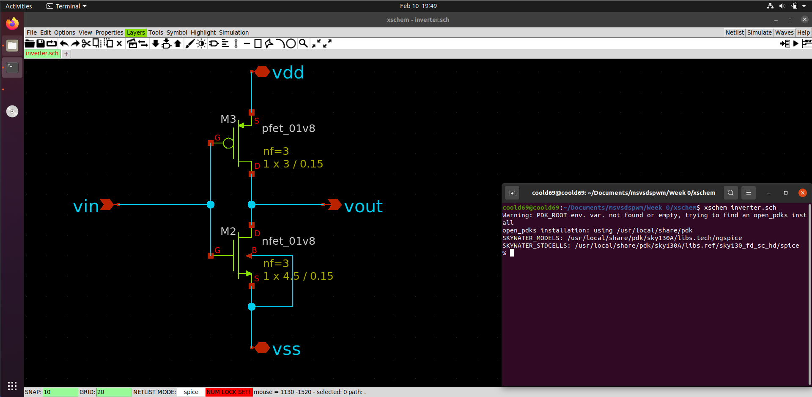<br /><br />
Convert the schematic to a symbol

<br /><br />
Using the symbol, we can create an independent test bench to simulate the circuit

<br /><br />

## Pre-Layout Simulation

### Creating and simulating testbench Schematic
The circuit can be simulated in ngspice. 

Netlist

```
** sch_path: /home/coold69/Documents/msvsdspwm/Week 0/xschem/inverter_tb.sch
**.subckt inverter_tb
X1 in out net1 GND inverter
V1 net1 GND 1.8
.save i(v1)
V2 in GND pulse(0 1.8 1n 1n 1n 4n 10n)
.save i(v2)
**** begin user architecture code


.lib ~/open_pdks/sources/sky130-pdk/libraries/sky130_fd_pr/latest/models/sky130.lib.spice tt
.control
save all
tran 1n 20n
plot v(in)
plot v(out)
.endc

**** end user architecture code
**.ends

* expanding   symbol:  inverter.sym # of pins=4
** sym_path: /home/coold69/Documents/msvsdspwm/Week 0/xschem/inverter.sym
** sch_path: /home/coold69/Documents/msvsdspwm/Week 0/xschem/inverter.sch
.subckt inverter vin vout vdd vss
*.ipin vin
*.opin vout
*.iopin vdd
*.iopin vss
XM2 vout vin vss vss sky130_fd_pr__nfet_01v8 L=0.15 W=4.5 nf=3 ad='int((nf+1)/2) * W/nf * 0.29' as='int((nf+2)/2) * W/nf * 0.29'
+ pd='2*int((nf+1)/2) * (W/nf + 0.29)' ps='2*int((nf+2)/2) * (W/nf + 0.29)' nrd='0.29 / W' nrs='0.29 / W'
+ sa=0 sb=0 sd=0 mult=1 m=1
XM3 vout vin vdd VDD sky130_fd_pr__pfet_01v8 L=0.15 W=3 nf=3 ad='int((nf+1)/2) * W/nf * 0.29' as='int((nf+2)/2) * W/nf * 0.29'
+ pd='2*int((nf+1)/2) * (W/nf + 0.29)' ps='2*int((nf+2)/2) * (W/nf + 0.29)' nrd='0.29 / W' nrs='0.29 / W'
+ sa=0 sb=0 sd=0 mult=1 m=1
.ends

.GLOBAL GND
.end
```


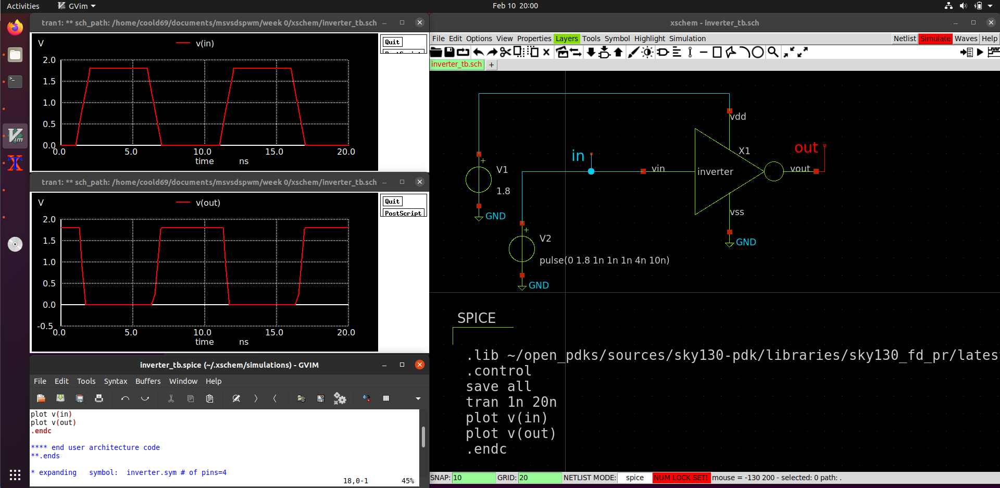


## Post-Layout Simulation
Inverter Layout Using Magic

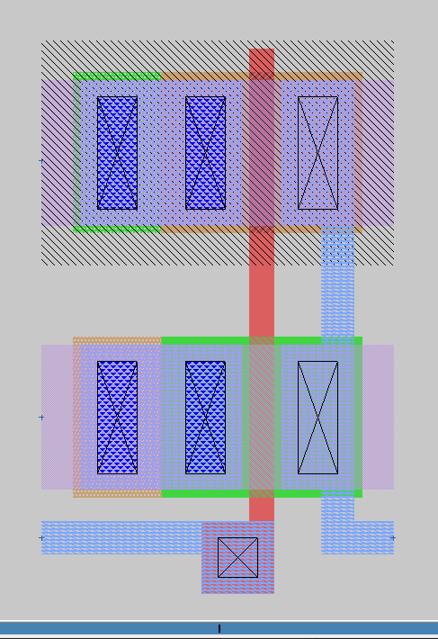

Extract Command from magic to ngspice
```
excract all
ext2spice hierarchy on
ext2spice scale off
ext2spice 
```
Netlist From Magic
```
* SPICE3 file created from inverter.ext - technology: sky130A

.subckt inverter vin vout vdd vss
X0 vout vin vss vss sky130_fd_pr__nfet_01v8 ad=5.5e+11p pd=3.1e+06u as=5.5e+11p ps=3.1e+06u w=1e+06u l=150000u
X1 vout vin vdd vdd sky130_fd_pr__pfet_01v8 ad=5.5e+11p pd=3.1e+06u as=5.5e+11p ps=3.1e+06u w=1e+06u l=150000u
.ends
```
Modify The Netlist So that we can run the simulation using ngspice

```
* SPICE3 file created from inverter.ext - technology: sky130A
*Added manually
X1 in out net1 GND inverter
V1 net1 GND 1.8
.save i(v1)
V2 in GND pulse(0 1.8 1n 1n 1n 4n 10n)
.save i(v2)

* Added manually
.lib ~/open_pdks/sources/sky130-pdk/libraries/sky130_fd_pr/latest/models/sky130.lib.spice tt
.control
save all
tran 1n 20n
plot v(in) v(out)
.endc

*Magic generated Netlist
.subckt inverter vin vout vdd vss
X0 vout vin vss vss sky130_fd_pr__nfet_01v8 ad=5.5e+11p pd=3.1e+06u as=5.5e+11p ps=3.1e+06u w=1e+06u l=150000u
X1 vout vin vdd vdd sky130_fd_pr__pfet_01v8 ad=5.5e+11p pd=3.1e+06u as=5.5e+11p ps=3.1e+06u w=1e+06u l=150000u
.ends

```


### Comparison of Pre-layout and Post-layout timing parameters for inverter.

| Parameter    | Value from Pre-layout Simulation| Value from Post-layout Simulation|
|----------|-----|-----|
|Rise Time|0.41 ns|0.7512 ns|
|Fall Time|0.4701 ns|0.64318 ns|
|Cell Rise Delay|032 ns|0.28 ns|
|Cell Fall Delay|0.43 ns|0.32 ns|

### LVS Report
The layout vs schematic compares the pre-layout netlist with the netlist extracted from the layout. The mismatch is due to the extra parasitic capacitances in the post-layout netlist. The report `comp.out` is obtained using Netgen by typing the following command.
```
netgen -batch lvs inverter.spice inverter_tb.spice
```
Subcircuit pins:
Circuit 1: inverter                        |Circuit 2: inverter                        
-------------------------------------------|-------------------------------------------
vout                                       |vout                                       
vin                                        |vin                                        
vss                                        |vss                                        
vdd                                        |vdd                                        
---------------------------------------------------------------------------------------
Cell pin lists are equivalent.
Device classes inverter and inverter are equivalent.

Subcircuit summary:
Circuit 1: inverter.spice                  |Circuit 2: inverter_tb.spice               
-------------------------------------------|-------------------------------------------
inverter (1)                               |inverter (1)                               
vsrc (2)                                   |vsrc (2)                                   
Number of devices: 3                       |Number of devices: 3                       
Number of nets: 4                          |Number of nets: 4                          
---------------------------------------------------------------------------------------
Netlists match uniquely.
Cells have no pins;  pin matching not needed.
Device classes inverter.spice and inverter_tb.spice are equivalent.

Final result: Circuits match uniquely.


## Circuit Simulation From Spice 

### Pre-layout Circuit 

<br>

#### Netlist

```

XPMOS Vout Vin VDD VDD sky130_fd_pr__pfet_01v8 L=0.15 W=1 nf=1 ad='int((nf+1)/2) * W/nf * 0.29' as='int((nf+2)/2) * W/nf * 0.29'
+ pd='2*int((nf+1)/2) * (W/nf + 0.29)' ps='2*int((nf+2)/2) * (W/nf + 0.29)' nrd='0.29 / W' nrs='0.29 / W'
+ sa=0 sb=0 sd=0 mult=1 m=1
XNMOS Vout Vin GND GND sky130_fd_pr__nfet_01v8 L=0.15 W=1 nf=1 ad='int((nf+1)/2) * W/nf * 0.29' as='int((nf+2)/2) * W/nf * 0.29'
+ pd='2*int((nf+1)/2) * (W/nf + 0.29)' ps='2*int((nf+2)/2) * (W/nf + 0.29)' nrd='0.29 / W' nrs='0.29 / W'
+ sa=0 sb=0 sd=0 mult=1 m=1


Vin Vin GND pulse(0 1.8 0.5ns 0.5ns 0.5ns 5ns 10ns)
.save i(vin)
VDD VDD GND 1.8
.save i(vdd)
**** begin user architecture code

.tran 0.01n 20n
.control
run
plot Vin Vout
.save all
.endc
.end


.lib /home/coold69/open_pdks/sky130/sky130A/libs.tech/ngspice/sky130.lib.spice tt

.save all


**** end user architecture code
**.ends
.end
```
#### Simulation
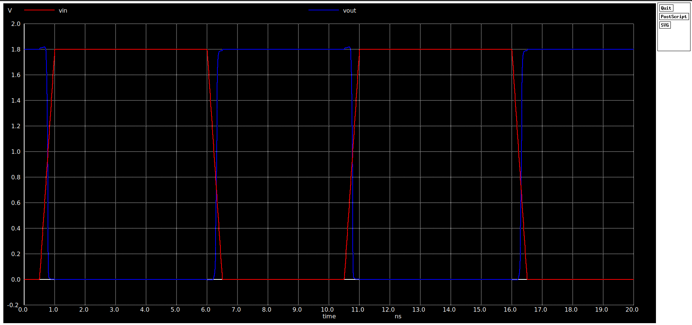
<br>

### Post Layout 

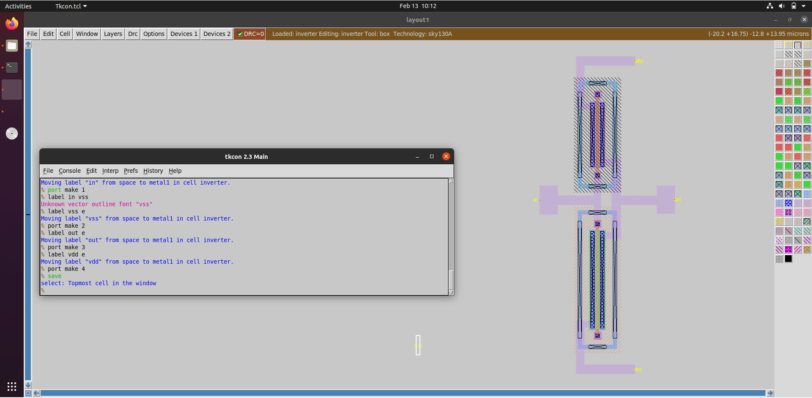

#### Netlist
This inverter.spice netlist generated post layout contains the parasitics that were absent in pre-layout netlist.

```
* NGSPICE file created from inverter.ext - technology: sky130A

.subckt sky130_fd_pr__pfet_01v8_XGS3BL a_n73_n100# a_15_n100# w_n211_n319# a_n33_n197#
+ VSUBS
X0 a_15_n100# a_n33_n197# a_n73_n100# w_n211_n319# sky130_fd_pr__pfet_01v8 ad=2.9e+11p pd=2.58e+06u as=2.9e+11p ps=2.58e+06u w=1e+06u l=150000u
C0 w_n211_n319# a_n73_n100# 0.09fF
C1 a_n33_n197# w_n211_n319# 0.26fF
C2 a_15_n100# a_n73_n100# 0.16fF
C3 a_n33_n197# a_15_n100# 0.03fF
C4 w_n211_n319# a_15_n100# 0.06fF
C5 a_n33_n197# a_n73_n100# 0.03fF
C6 a_15_n100# VSUBS 0.02fF
C7 a_n73_n100# VSUBS 0.02fF
C8 a_n33_n197# VSUBS 0.05fF
C9 w_n211_n319# VSUBS 1.07fF
.ends

.subckt sky130_fd_pr__nfet_01v8_648S5X a_n73_n100# a_n33_n188# a_15_n100# a_n175_n274#
X0 a_15_n100# a_n33_n188# a_n73_n100# a_n175_n274# sky130_fd_pr__nfet_01v8 ad=2.9e+11p pd=2.58e+06u as=2.9e+11p ps=2.58e+06u w=1e+06u l=150000u
C0 a_n33_n188# a_15_n100# 0.03fF
C1 a_n73_n100# a_n33_n188# 0.03fF
C2 a_n73_n100# a_15_n100# 0.16fF
C3 a_15_n100# a_n175_n274# 0.08fF
C4 a_n73_n100# a_n175_n274# 0.11fF
C5 a_n33_n188# a_n175_n274# 0.30fF
.ends

.subckt inverter vin gnd vout vdd
XXPMOS vdd vout XPMOS/w_n211_n319# vin VSUBS sky130_fd_pr__pfet_01v8_XGS3BL
XXNMOS gnd vin vout VSUBS sky130_fd_pr__nfet_01v8_648S5X
C0 XPMOS/w_n211_n319# vdd 0.19fF
C1 vout vdd 0.01fF
C2 vin XPMOS/w_n211_n319# 0.08fF
C3 vin vout 0.05fF
C4 vout XPMOS/w_n211_n319# 0.13fF
C5 vin gnd 0.10fF
C6 vout gnd 0.01fF
C7 vin vdd 0.10fF
C8 vin VSUBS 0.38fF
C9 vout VSUBS 0.23fF
C10 gnd VSUBS 0.28fF
C11 vdd VSUBS 0.02fF
C12 XPMOS/w_n211_n319# VSUBS 1.11fF
.ends

```


## Simulation of a function using Magic and Ngspice
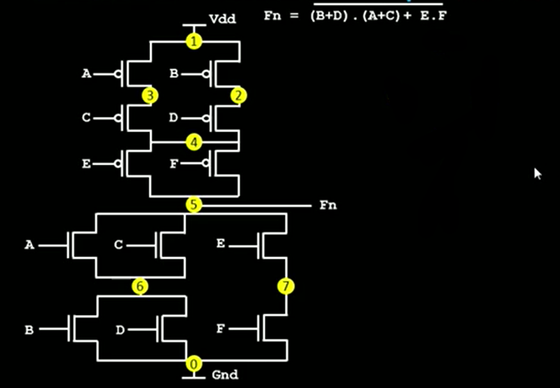


### Pre-layout Simulation of function Fn using Ngspice
The netlist ```fn_prelayout.spice``` for the function Fn given can be written as

```
***Netlist description for prelayout simulation***
M1 3 a vdd vdd pmos W=2.125u L=0.25u
M2 2 b vdd vdd pmos W=2.125u L=0.25u
M3 4 d 2 2 pmos W=2.125u L=0.25u
M4 4 c 3 3 pmos W=2.125u L=0.25u
M5 out e 4 4 pmos W=2.125u L=0.25u
M6 out f 4 4 pmos W=2.125u L=0.25u

M7 out a 6 6 nmos W=2.125u L=0.25u
M8 out c 6 6 nmos W=2.125u L=0.25u
M9 out e 7 7 nmos W=2.125u L=0.25u
M10 6 b 0 0 nmos W=2.125u L=0.25u
M11 6 d 0 0 nmos W=2.125u L=0.25u
M12 7 f 0 0 nmos W=2.125u L=0.25u

cload out 0 10f

Vdd vdd 0 2.5
V1 a 0 0 pulse 0 2.5 0.1n 10p 10p 1n 2n
V2 b 0 0 pulse 0 2.5 0.2n 10p 10p 1n 2n
V3 c 0 0 pulse 0 2.5 0.3n 10p 10p 1n 2n
V4 d 0 0 pulse 0 2.5 0.4n 10p 10p 1n 2n
V5 e 0 0 pulse 0 2.5 0.5n 10p 10p 1n 2n
V6 f 0 0 pulse 0 2.5 0.6n 10p 10p 1n 2n

***Simulation commands***
.op
.tran 10p 4n

*** .include model file ***
.include my_model_file.mod
.end

```

Run the ngspice simulation using the following commands.
```
    $ngspice fn_prelayout.spice
```
```
    ngspice 2 -> run
    ngspice 3 -> plot out
```


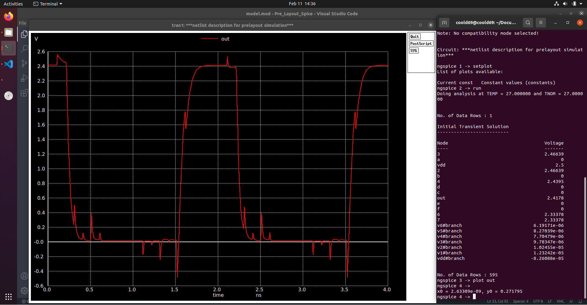

### Post-layout Simulation of function Fn using Magic and Ngspice

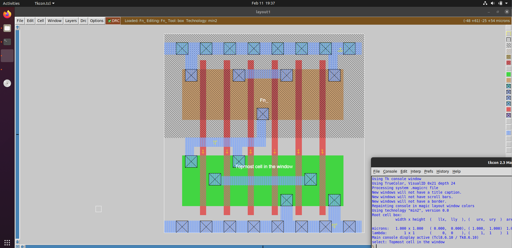<br>

The netlist fn_postlayout.spice generated is as shown. The netlist shows the parasitic capacitances also. Model file is same as the one used for pre-layout simulation.

```
* SPICE3 file created from Fn_.ext - technology: min2

.option scale=0.09u

M1000 a_46_38# d a_22_38# vdd pmos w=17 l=2
+  ad=102 pd=46 as=204 ps=92
M1001 out c a_14_9# gnd nmos w=17 l=2
+  ad=204 pd=92 as=204 ps=92
M1002 vdd b a_46_38# vdd pmos w=17 l=2
+  ad=204 pd=92 as=0 ps=0
M1003 gnd f a_30_9# gnd nmos w=17 l=2
+  ad=204 pd=92 as=102 ps=46
M1004 gnd b a_14_9# gnd nmos w=17 l=2
+  ad=0 pd=0 as=0 ps=0
M1005 out e a_22_38# vdd pmos w=17 l=2
+  ad=102 pd=46 as=0 ps=0
M1006 a_14_38# a vdd vdd pmos w=17 l=2
+  ad=102 pd=46 as=0 ps=0
M1007 a_14_9# a out gnd nmos w=17 l=2
+  ad=0 pd=0 as=0 ps=0
M1008 a_30_9# e out gnd nmos w=17 l=2
+  ad=0 pd=0 as=0 ps=0
M1009 a_22_38# f out vdd pmos w=17 l=2
+  ad=0 pd=0 as=0 ps=0
M1010 a_22_38# c a_14_38# vdd pmos w=17 l=2
+  ad=0 pd=0 as=0 ps=0
M1011 a_14_9# d gnd gnd nmos w=17 l=2
+  ad=0 pd=0 as=0 ps=0
C0 a_30_9# gnd 3.37fF
C1 a_14_9# gnd 6.82fF
C2 out gnd 8.40fF
C3 a_22_38# gnd 3.02fF
C4 vdd gnd 9.58fF


Vdd vdd 0 2.5
V1 a 0 0 pulse 0 2.5 0.1n 10p 10p 1n 2n
V2 b 0 0 pulse 0 2.5 0.2n 10p 10p 1n 2n
V3 c 0 0 pulse 0 2.5 0.3n 10p 10p 1n 2n
V4 d 0 0 pulse 0 2.5 0.4n 10p 10p 1n 2n
V5 e 0 0 pulse 0 2.5 0.5n 10p 10p 1n 2n
V6 f 0 0 pulse 0 2.5 0.6n 10p 10p 1n 2n
***Simulation commands***
.op
.tran 10p 4n
*** .include model file ***
.include  model.mod
.end

```

Run the ngspice simulation using the following commands.

```
    ngspice Fn_.spice
```
```
    ngspice 2 -> run
    ngspice 3 -> plot out
```

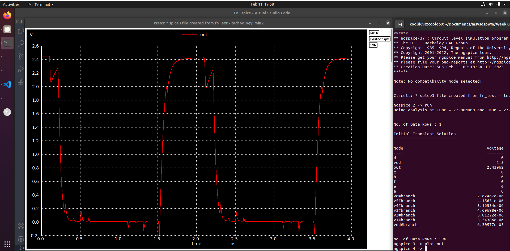

### Comparison of results
We can note that the graph of out vs time for both pre-layout simulation and post layout simulation are similar.

### LVS Report Function
The layout vs schematic compares the pre-layout netlist with the netlist extracted from the layout. The mismatch is due to the extra parasitic capacitances in the post-layout netlist. The report `comp.out` is obtained using Netgen by typing the following command.

```
netgen -batch lvs Fn_.spice Fn_prelayout.spice 
```

Netlists do not match.
Cells have no pins;  pin matching not needed.
Device classes Fn_.spice and Fn_prelayout.spice are equivalent.

Final result: Netlists do not match.


## Inverter using ALIGN
A simple SPICE Netlist for inverter is written to generate .lef and .gds files
```
.subckt inverter vinn voutn vdd 0
m1 voutn vinn vdd vdd pmos_rvt w=840e-9 l=150e-9 nf=2
m2 voutn vinn 0 0 nmos_rvt w=840e-9 l=150e-9 nf=2
.ends inverter
** End of subcircuit definition.

```
<!-- Create a file inverter.sp inside ALIGN  -->

ALIGN command 
```
schematic2layout.py ../ALIGN-pdk-sky130/examples/inverter -p ../pdks/SKY130_PDK/
```


- ### .gds
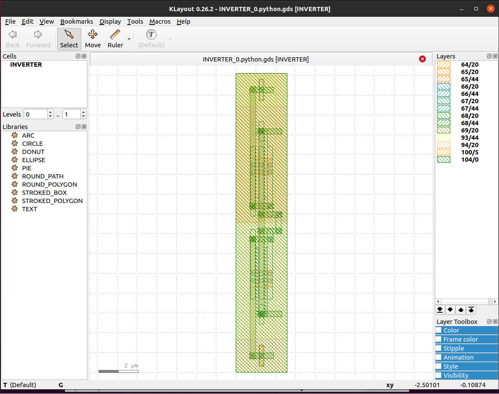
<br><br>

- ### .lef
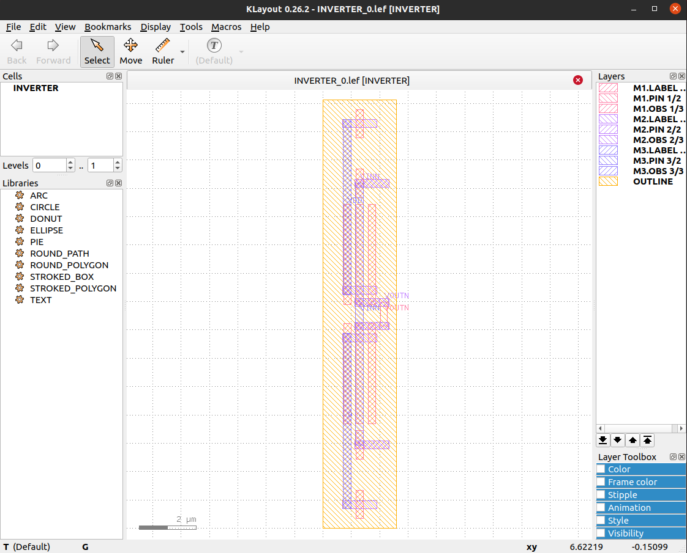
<br><br>


## Week 1
