# VSD-Mixed-Signal-PD-Research


This repository contains the documentation of the work done during a 10 Weeks VSD-Mixed-Signal-PD-Research carried out by VSD.


## Index
* [Week 0](#week-0)
* [Week 1](#week-1)
* [Week 2](#week-2)
* [Week 3](#week-3)
* [Week 4](#week-4)
<!-- * [Week 5](#week-5)
* [Week 5](#week-5)
* [Week 5](#week-5)
* [Week 5](#week-5)
* [Week 5](#week-5) -->


For view The Full Folder Structure Here👇
<details><summary>Folder Structure</summary>

```
├───Installation
│   ├───Reference
│   ├───Tools
│   └───VM
├───Resources
│   ├───week0
│   ├───week1
│   └───week2
├───Week 0
│   ├───Function_Simulation
│   │   ├───LVS
│   │   ├───Post_Layout_Spice
│   │   └───Pre_Layout_Spice
│   ├───mag
│   ├───netgen
│   ├───Spice_Netlist
│   │   ├───mag
│   │   ├───netgen
│   │   ├───Post_layout
│   │   ├───Pre_Layout
│   │   └───xschem
│   └───xschem
├───Week 1
│   ├───Compare 10 _ 4
│   │   ├───Post_Layout
│   │   ├───Pre_layout
│   │   └───work
│   │       ├───1_topology
│   │       ├───2_primitives
│   │       ├───3_pnr
│   │       │   ├───inputs
│   │       │   └───Results
│   │       └───LOG
│   ├───Function_Sky130
│   │   ├───FUN_ALIGN
│   │   │   ├───1_topology
│   │   │   ├───2_primitives
│   │   │   ├───3_pnr
│   │   │   │   ├───inputs
│   │   │   │   └───Results
│   │   │   └───LOG
│   │   ├───Post_Layout
│   │   └───Pre_layout
│   ├───Function_W=1_L=0.15
│   │   ├───netgen
│   │   ├───Post_Layout
│   │   └───Pre_layout
│   ├───mag_1
│   ├───mag_2
│   ├───mag_3
│   ├───mag_4
│   ├───mag_5
│   ├───mag_test
│   ├───netgen
│   ├───xschem
│   └───xschem 840_1680
└───Week 2
    └───Temperature_Sensor_Google_Collab
```
</details>


# Week 0

### Index
- [Installing Requires Tools](#installing-requires-tools)
    * [Oracle Virtual Box with Ubuntu 20.04](Installation/VM/README.md)
    * [Tools and SKY130 PDKs](Installation/Tools/README.md)
        + [Magic](Installation/Tools/README.md#magic)
        + [Ngspice](Installation/Tools/README.md#ngspice)
        + [Netgen](Installation/Tools/README.md#netgen)
        + [Xschem](Installation/Tools/README.md#xschem)
        + [Open_PDKs](Installation/Tools/README.md#open_pdk)
        + [ALIGN Tool](Installation/Tools/README.md#installing-align)
- [Creating inverter schematic using xschem](#creating-inverter-schematic-using-xschem)
    * [Pre-Layout Simulation](#pre-layout-simulation)
        + [Creating and simulating testbench Schematic](#creating-and-simulating-testbench-schematic)
    * [Post-Layout Simulation](#post-layout-simulation)
    * [Comparison of Pre-layout and Post-layout timing parameters for inverter](#comparison-of-pre-layout-and-post-layout-timing-parameters-for-inverter)
    * [LVS Report](#lvs-report)
    
- [Circuit Simulation From Spice ](#circuit-simulation-from-spice)
    * [Pre-layout Circuit ](#pre-layout-circuit)
    * [Post Layout ](#post-layout)
    * [LVS Report](#lvs-report-spice-netlist-magic)

- [Simulation of a function using Magic and Ngspice](#simulation-of-a-function-using-magic-and-ngspice)
    * [Pre-layout Simulation](#pre-layout-simulation-of-function-fn-using-ngspice)
    * [Post-layout Simulation](#post-layout-simulation-of-function-fn-using-magic-and-ngspice)
    * [Comparison of results](#comparison-of-results)
    * [LVS Report](#lvs-report-function)
- [Inverter using ALIGN](#inverter-using-align)
    * [.gds](#.gds)
    * [.lef](#.lef)


### Installing Requires Tools

For the Entire work Ubuntu 20.04 is used . Installing Ubuntu20.04 on Windows install Oracle virtual box with Ubuntu 20.04 - RAM at least 4GB, hard-disk atleast 100GB. [more info](Installation/VM/README.md)

AI Tools installation Guide [Here](Installation/Tools/README.md)


### Creating inverter schematic using xschem
An initial schematic is made by placing components from the open_pdk library.

The required changes to the properties of the device can be made here and will automatically reflect in the layout

<!-- <br /><br /> -->

Convert the schematic to a symbol

<!-- <br /><br /> -->


Using the symbol, we can create an independent test bench to simulate the circuit

<!--  -->

<br /><br />

## Pre-Layout Simulation

### Creating and simulating testbench Schematic
The circuit can be simulated in ngspice. 

Netlist

```
** sch_path: /home/coold69/Documents/msvsdspwm/Week 0/xschem/inverter_tb.sch
**.subckt inverter_tb
X1 in out net1 GND inverter
V1 net1 GND 1.8
.save i(v1)
V2 in GND pulse(0 1.8 1n 1n 1n 4n 10n)
.save i(v2)
**** begin user architecture code


.lib ~/open_pdks/sources/sky130-pdk/libraries/sky130_fd_pr/latest/models/sky130.lib.spice tt
.control
save all
tran 1n 20n
plot v(in)
plot v(out)
.endc

**** end user architecture code
**.ends

* expanding   symbol:  inverter.sym # of pins=4
** sym_path: /home/coold69/Documents/msvsdspwm/Week 0/xschem/inverter.sym
** sch_path: /home/coold69/Documents/msvsdspwm/Week 0/xschem/inverter.sch
.subckt inverter vin vout vdd vss
*.ipin vin
*.opin vout
*.iopin vdd
*.iopin vss
XM2 vout vin vss vss sky130_fd_pr__nfet_01v8 L=0.15 W=4.5 nf=3 ad='int((nf+1)/2) * W/nf * 0.29' as='int((nf+2)/2) * W/nf * 0.29'
+ pd='2*int((nf+1)/2) * (W/nf + 0.29)' ps='2*int((nf+2)/2) * (W/nf + 0.29)' nrd='0.29 / W' nrs='0.29 / W'
+ sa=0 sb=0 sd=0 mult=1 m=1
XM3 vout vin vdd VDD sky130_fd_pr__pfet_01v8 L=0.15 W=3 nf=3 ad='int((nf+1)/2) * W/nf * 0.29' as='int((nf+2)/2) * W/nf * 0.29'
+ pd='2*int((nf+1)/2) * (W/nf + 0.29)' ps='2*int((nf+2)/2) * (W/nf + 0.29)' nrd='0.29 / W' nrs='0.29 / W'
+ sa=0 sb=0 sd=0 mult=1 m=1
.ends

.GLOBAL GND
.end
```


<!--  -->


## Post-Layout Simulation
Inverter Layout Using Magic

<!--  -->


Extract Command from magic to ngspice
```
excract all
ext2spice hierarchy on
ext2spice scale off
ext2spice 
```
Netlist From Magic
```
* NGSPICE file created from inverter.ext - technology: sky130A

.subckt inverter vin vout vdd vss
X0 vout vin vss vss sky130_fd_pr__nfet_01v8 ad=5.5e+11p pd=3.1e+06u as=5.5e+11p ps=3.1e+06u w=1e+06u l=150000u
X1 vout vin vdd vdd sky130_fd_pr__pfet_01v8 ad=5.5e+11p pd=3.1e+06u as=5.5e+11p ps=3.1e+06u w=1e+06u l=150000u
C0 vdd vout 0.16fF
C1 vout vin 0.04fF
C2 vdd vin 0.08fF
.ends

```
Modify The Netlist So that we can run the simulation using ngspice

```
* SPICE3 file created from inverter.ext - technology: sky130A
*Added manually
X1 in out net1 GND inverter
V1 net1 GND 1.8
.save i(v1)
V2 in GND pulse(0 1.8 1n 1n 1n 4n 10n)
.save i(v2)

* Added manually
.lib ~/open_pdks/sources/sky130-pdk/libraries/sky130_fd_pr/latest/models/sky130.lib.spice tt
.control
save all
tran 1n 20n
plot v(in) v(out)
.endc

*Magic generated Netlist
.subckt inverter vin vout vdd vss
X0 vout vin vss vss sky130_fd_pr__nfet_01v8 ad=5.5e+11p pd=3.1e+06u as=5.5e+11p ps=3.1e+06u w=1e+06u l=150000u
X1 vout vin vdd vdd sky130_fd_pr__pfet_01v8 ad=5.5e+11p pd=3.1e+06u as=5.5e+11p ps=3.1e+06u w=1e+06u l=150000u
.ends

```
<!--  -->


### Comparison of Pre-layout and Post-layout timing parameters for inverter.

| Parameter    | Value from Pre-layout Simulation| Value from Post-layout Simulation|
|----------|-----|-----|
|Rise Time|0.41 ns|0.7512 ns|
|Fall Time|0.4701 ns|0.64318 ns|
|Cell Rise Delay|032 ns|0.28 ns|
|Cell Fall Delay|0.43 ns|0.32 ns|

### LVS Report
The layout vs schematic compares the pre-layout netlist with the netlist extracted from the layout. The mismatch is due to the extra parasitic capacitances in the post-layout netlist. The report `comp.out` is obtained using Netgen by typing the following command.
```
netgen -batch lvs inverter.spice inverter_tb.spice
```
Subcircuit pins:
Circuit 1: inverter                        |Circuit 2: inverter                        
-------------------------------------------|-------------------------------------------
vout                                       |vout                                       
vin                                        |vin                                        
vss                                        |vss                                        
vdd                                        |vdd                                        
---------------------------------------------------------------------------------------
Cell pin lists are equivalent.
Device classes inverter and inverter are equivalent.

Subcircuit summary:
Circuit 1: inverter.spice                  |Circuit 2: inverter_tb.spice               
-------------------------------------------|-------------------------------------------
inverter (1)                               |inverter (1)                               
vsrc (2)                                   |vsrc (2)                                   
Number of devices: 3                       |Number of devices: 3                       
Number of nets: 4                          |Number of nets: 4                          
---------------------------------------------------------------------------------------
Netlists match uniquely.
Cells have no pins;  pin matching not needed.
Device classes inverter.spice and inverter_tb.spice are equivalent.

Final result: Circuits match uniquely.


## Circuit Simulation From Spice 

### Pre-layout Circuit 
<!--  -->


<br>

#### Netlist

```

XPMOS Vout Vin VDD VDD sky130_fd_pr__pfet_01v8 L=0.15 W=1 nf=1 ad='int((nf+1)/2) * W/nf * 0.29' as='int((nf+2)/2) * W/nf * 0.29'
+ pd='2*int((nf+1)/2) * (W/nf + 0.29)' ps='2*int((nf+2)/2) * (W/nf + 0.29)' nrd='0.29 / W' nrs='0.29 / W'
+ sa=0 sb=0 sd=0 mult=1 m=1
XNMOS Vout Vin GND GND sky130_fd_pr__nfet_01v8 L=0.15 W=1 nf=1 ad='int((nf+1)/2) * W/nf * 0.29' as='int((nf+2)/2) * W/nf * 0.29'
+ pd='2*int((nf+1)/2) * (W/nf + 0.29)' ps='2*int((nf+2)/2) * (W/nf + 0.29)' nrd='0.29 / W' nrs='0.29 / W'
+ sa=0 sb=0 sd=0 mult=1 m=1


Vin Vin GND pulse(0 1.8 0.5ns 0.5ns 0.5ns 5ns 10ns)
.save i(vin)
VDD VDD GND 1.8
.save i(vdd)
**** begin user architecture code

.tran 0.01n 20n
.control
run
plot Vin Vout
.save all
.endc
.end


.lib /home/coold69/open_pdks/sky130/sky130A/libs.tech/ngspice/sky130.lib.spice tt

.save all


**** end user architecture code
**.ends
.end
```
#### Simulation
<!--  -->


<br>

### Post Layout 

<!-- 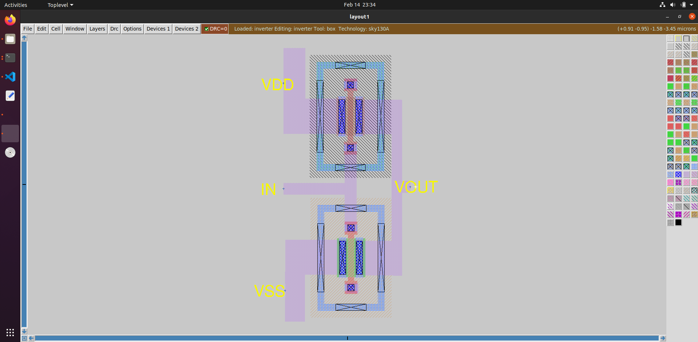 -->


<br>


#### Netlist
This inverter.spice netlist generated post layout contains the parasitics that were absent in pre-layout netlist.

For view The Full Netlist Click Here👇
<details><summary>Netlist</summary>

```
* NGSPICE file created from inverter.ext - technology: sky130A

.subckt sky130_fd_pr__pfet_01v8_XGS3BL a_n73_n100# a_15_n100# w_n211_n319# a_n33_n197#
+ VSUBS
X0 a_15_n100# a_n33_n197# a_n73_n100# w_n211_n319# sky130_fd_pr__pfet_01v8 ad=2.9e+11p pd=2.58e+06u as=2.9e+11p ps=2.58e+06u w=1e+06u l=150000u
C0 a_15_n100# a_n73_n100# 0.16fF
C1 w_n211_n319# a_n33_n197# 0.26fF
C2 a_15_n100# a_n33_n197# 0.03fF
C3 a_15_n100# w_n211_n319# 0.06fF
C4 a_n73_n100# a_n33_n197# 0.03fF
C5 w_n211_n319# a_n73_n100# 0.09fF
C6 a_15_n100# VSUBS 0.02fF
C7 a_n73_n100# VSUBS 0.02fF
C8 a_n33_n197# VSUBS 0.05fF
C9 w_n211_n319# VSUBS 1.07fF
.ends

.subckt sky130_fd_pr__nfet_01v8_648S5X a_n73_n100# a_n33_n188# a_15_n100# a_n175_n274#
X0 a_15_n100# a_n33_n188# a_n73_n100# a_n175_n274# sky130_fd_pr__nfet_01v8 ad=2.9e+11p pd=2.58e+06u as=2.9e+11p ps=2.58e+06u w=1e+06u l=150000u
C0 a_n33_n188# a_n73_n100# 0.03fF
C1 a_15_n100# a_n73_n100# 0.16fF
C2 a_n33_n188# a_15_n100# 0.03fF
C3 a_15_n100# a_n175_n274# 0.08fF
C4 a_n73_n100# a_n175_n274# 0.11fF
C5 a_n33_n188# a_n175_n274# 0.30fF
.ends

.subckt inverter in out VP VN
XXM1 VP out XM1/w_n211_n319# in VSUBS sky130_fd_pr__pfet_01v8_XGS3BL
XXM2 VN in out VSUBS sky130_fd_pr__nfet_01v8_648S5X
C0 XM1/w_n211_n319# in 0.10fF
C1 out VP -0.00fF
C2 VN in 0.06fF
C3 VN XM1/w_n211_n319# 0.00fF
C4 out in 0.08fF
C5 out XM1/w_n211_n319# 0.12fF
C6 out VN -0.00fF
C7 VP in 0.06fF
C8 XM1/w_n211_n319# VP 0.10fF
C9 in VSUBS 0.38fF
C10 out VSUBS 0.40fF
C11 VN VSUBS 0.33fF
C12 VP VSUBS 0.16fF
C13 XM1/w_n211_n319# VSUBS 1.13fF
.ends


*==========Simulation=========
X1 in out net1 GND inverter
V1 net1 GND 1.8
.save i(net1)
V2 in GND pulse(0 1.8 1n 1n 1n 4n 10n)
.save i(in)
**** begin user architecture code


.lib ~/open_pdks/sources/sky130-pdk/libraries/sky130_fd_pr/latest/models/sky130.lib.spice tt
.control
save all
tran 1n 20n
plot v(in) v(out)
.endc

```
</details>

<br>
<!--  -->


 <br><br>


<!-- 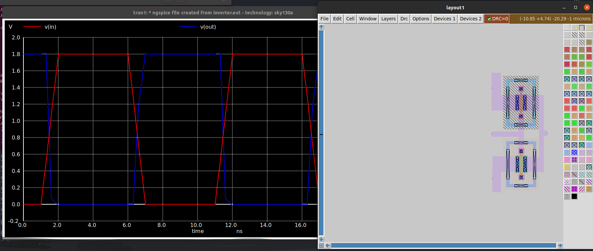  -->


<br><br>

### LVS Report Spice Netlist Magic
The layout vs schematic compares the pre-layout netlist with the netlist extracted from the layout. The mismatch is due to the extra parasitic capacitances in the post-layout netlist. The report `comp.out` is obtained using Netgen by typing the following command.

```
netgen -batch lvs inverter_pre.spice inverter_post.spice 
```
Subcircuit summary:
Circuit 1: inverter_pre.spice              |Circuit 2: inverter_post.spice             
-------------------------------------------|-------------------------------------------
Instance: sky130_fd_pr__nfet_01v8:M2       |Instance: inverter:1/sky130_fd_pr__nfet_01 
  1 = 2                                    |  1 = 8                                    
  2 = 2                                    |  2 = 10                                   
  3 = 2                                    |  3 = 8                                    
  4 = 2                                    |  4 = 6                                    
---------------------------------------------------------------------------------------
Netlists do not match.
Cells have no pins;  pin matching not needed.
Device classes inverter_pre.spice and inverter_post.spice are equivalent.

Final result: Netlists do not match.


## Simulation of a function using Magic and Ngspice
<!-- <br> -->


### Pre-layout Simulation of function Fn using Ngspice
The netlist ```fn_prelayout.spice``` for the function Fn given can be written as<br><br>
For view The Full Netlist Click Here👇
<details><summary>Netlist</summary>

```
***Netlist description for prelayout simulation***
M1 3 a vdd vdd pmos W=2.125u L=0.25u
M2 2 b vdd vdd pmos W=2.125u L=0.25u
M3 4 d 2 2 pmos W=2.125u L=0.25u
M4 4 c 3 3 pmos W=2.125u L=0.25u
M5 out e 4 4 pmos W=2.125u L=0.25u
M6 out f 4 4 pmos W=2.125u L=0.25u

M7 out a 6 6 nmos W=2.125u L=0.25u
M8 out c 6 6 nmos W=2.125u L=0.25u
M9 out e 7 7 nmos W=2.125u L=0.25u
M10 6 b 0 0 nmos W=2.125u L=0.25u
M11 6 d 0 0 nmos W=2.125u L=0.25u
M12 7 f 0 0 nmos W=2.125u L=0.25u

cload out 0 10f

Vdd vdd 0 2.5
V1 a 0 0 pulse 0 2.5 0.1n 10p 10p 1n 2n
V2 b 0 0 pulse 0 2.5 0.2n 10p 10p 1n 2n
V3 c 0 0 pulse 0 2.5 0.3n 10p 10p 1n 2n
V4 d 0 0 pulse 0 2.5 0.4n 10p 10p 1n 2n
V5 e 0 0 pulse 0 2.5 0.5n 10p 10p 1n 2n
V6 f 0 0 pulse 0 2.5 0.6n 10p 10p 1n 2n

***Simulation commands***
.op
.tran 10p 4n

*** .include model file ***
.include my_model_file.mod
.end

```
</details><br>

Run the ngspice simulation using the following commands.
```
    $ngspice fn_prelayout.spice
```
```
    ngspice 2 -> run
    ngspice 3 -> plot out
```


<!--  -->

### Post-layout Simulation of function Fn using Magic and Ngspice

<!-- <br> -->


The netlist fn_postlayout.spice generated is as shown. The netlist shows the parasitic capacitances also. Model file is same as the one used for pre-layout simulation.

For view The Full Netlist Click Here👇
<details><summary>Netlist</summary>

```
* SPICE3 file created from Fn_.ext - technology: min2

.option scale=0.09u

M1000 a_46_38# d a_22_38# vdd pmos w=17 l=2
+  ad=102 pd=46 as=204 ps=92
M1001 out c a_14_9# gnd nmos w=17 l=2
+  ad=204 pd=92 as=204 ps=92
M1002 vdd b a_46_38# vdd pmos w=17 l=2
+  ad=204 pd=92 as=0 ps=0
M1003 gnd f a_30_9# gnd nmos w=17 l=2
+  ad=204 pd=92 as=102 ps=46
M1004 gnd b a_14_9# gnd nmos w=17 l=2
+  ad=0 pd=0 as=0 ps=0
M1005 out e a_22_38# vdd pmos w=17 l=2
+  ad=102 pd=46 as=0 ps=0
M1006 a_14_38# a vdd vdd pmos w=17 l=2
+  ad=102 pd=46 as=0 ps=0
M1007 a_14_9# a out gnd nmos w=17 l=2
+  ad=0 pd=0 as=0 ps=0
M1008 a_30_9# e out gnd nmos w=17 l=2
+  ad=0 pd=0 as=0 ps=0
M1009 a_22_38# f out vdd pmos w=17 l=2
+  ad=0 pd=0 as=0 ps=0
M1010 a_22_38# c a_14_38# vdd pmos w=17 l=2
+  ad=0 pd=0 as=0 ps=0
M1011 a_14_9# d gnd gnd nmos w=17 l=2
+  ad=0 pd=0 as=0 ps=0
C0 a_30_9# gnd 3.37fF
C1 a_14_9# gnd 6.82fF
C2 out gnd 8.40fF
C3 a_22_38# gnd 3.02fF
C4 vdd gnd 9.58fF


Vdd vdd 0 2.5
V1 a 0 0 pulse 0 2.5 0.1n 10p 10p 1n 2n
V2 b 0 0 pulse 0 2.5 0.2n 10p 10p 1n 2n
V3 c 0 0 pulse 0 2.5 0.3n 10p 10p 1n 2n
V4 d 0 0 pulse 0 2.5 0.4n 10p 10p 1n 2n
V5 e 0 0 pulse 0 2.5 0.5n 10p 10p 1n 2n
V6 f 0 0 pulse 0 2.5 0.6n 10p 10p 1n 2n
***Simulation commands***
.op
.tran 10p 4n
*** .include model file ***
.include  model.mod
.end

```
</details>
Run the ngspice simulation using the following commands.

```
    ngspice Fn_.spice
```
```
    ngspice 2 -> run
    ngspice 3 -> plot out
```

<!--  -->


### Comparison of results
We can note that the graph of out vs time for both pre-layout simulation and post layout simulation are similar.

### LVS Report Function
The layout vs schematic compares the pre-layout netlist with the netlist extracted from the layout. The mismatch is due to the extra parasitic capacitances in the post-layout netlist. The report `comp.out` is obtained using Netgen by typing the following command.

```
netgen -batch lvs Fn_.spice Fn_prelayout.spice 
```

Netlists do not match.
Cells have no pins;  pin matching not needed.
Device classes Fn_.spice and Fn_prelayout.spice are equivalent.

Final result: Netlists do not match.


## Inverter using ALIGN
A simple SPICE Netlist for inverter is written to generate .lef and .gds files
```
.subckt inverter vinn voutn vdd 0
m1 voutn vinn vdd vdd pmos_rvt w=840e-9 l=150e-9 nf=2
m2 voutn vinn 0 0 nmos_rvt w=840e-9 l=150e-9 nf=2
.ends inverter
** End of subcircuit definition.

```
<!-- Create a file inverter.sp inside ALIGN  -->

ALIGN command 
```
schematic2layout.py ../ALIGN-pdk-sky130/examples/inverter -p ../pdks/SKY130_PDK/
```


- ### .gds
<!--  -->


<br><br>

- ### .lef
<!--  -->


<br><br>


# Week 1

### Index
- [Installing Requires Tools](#installing-requires-tools)

- [Inverter post-layout characterization](#inverter-post-layout-characterization)
    * [Inverter pre Layout ](#inverter-pre-layout)
    * [Inverter Post-layout From ALIGN](#inverter-post-layout-from-align)
    * [Comparison of Pre-layout and Post-layout Simulation inverter](#comparison-of-pre-layout-and-post-layout-simulation-inverter)
    * [LVS Report](#lvs-report-inverter-post-layout-characterization)
    
- [Design pre-layout using xschem/ngspice using SKY130 PDKSCircuit Simulation From Spice ](#design-pre-layout-using-xschemngspice-using-sky130-pdks)
    * [Pre-Layout Simulation Of a Function ](#pre-layout-simulation-of-a-function)
    * [Xschem Circuit and Simulation ](#xschem-circuit-and-simulation)
    * [Post layout characterization using magic/ngspice and SKY130 PDKs (xschem technique)](#post-layout-characterization-using-magicngspice-and-sky130-pdks-xschem-technique)
    * [Comparison of Pre-layout and Post-layout Simulation Function Magic/Xschem](#comparison-of-pre-layout-and-post-layout-simulation-function-magicxschem)
    * [LVS Report](#lvs-report-function-magicxschem)

- [Post layout characterization using ALIGN ](#post-layout-characterization-using-align)
    * [Xschem Circuit Diagram](#xschem-circuit-diagram)
         + [Simulation](#simulation)
    * [Pre Layout Simulation](#pre-layout-simulation-aligna)
    * [ALIGN Generated Layout](#align-generated-layout)
    * [ALIGN Generated Layout in Magic](#align-generated-layout-in-magic)
    * [Magic Generated Netlist](#magic-generated-netlist)
    * [Magic Generated Netlist without parasitic](#magic-generated-netlist-without-parasitic)
    * [Comparison](#comparison)
    * [LVS Report](#lvs-report-align-magic)
<!-- - [Inverter using ALIGN](#inverter-using-align)
    * [.gds](#.gds)
    * [.lef](#.lef) --> 

## Inverter post-layout characterization

### Inverter pre Layout 

Spice Netlist :
```
X1 in out net1 GND inverter
V1 net1 GND 1.8
.save i(v1)
V2 in GND pulse(0 1.8 1n 1n 1n 4n 10n)
.save i(v2)
**** begin user architecture code

.lib ~/open_pdks/sources/sky130-pdk/libraries/sky130_fd_pr/latest/models/sky130.lib.spice tt
.control
save all
tran 1n 20n
plot v(in) v(out)
.endc

.subckt INV vin vout vdd vss
XM2 vout vin vss vss sky130_fd_pr__nfet_01v8 L=0.15 W=4.2 nf=2 
XM3 vout vin vdd vdd sky130_fd_pr__pfet_01v8 L=0.15 W=8.4 nf=2
.ends
.GLOBAL GND
.end
```
Ngspice Command
```
ngspice INV.sp
```
Simulation

<!-- 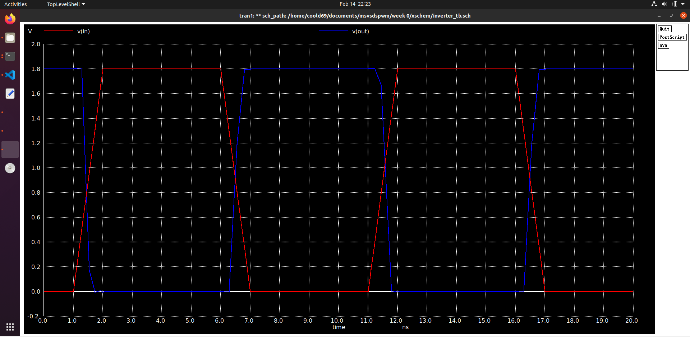 -->


### Inverter Post-layout From ALIGN
netlist generated by magic

For view The Full Netlist Click Here👇
<details><summary>Netlist</summary>


```
* NGSPICE file created from INV_0.ext - technology: sky130A

.subckt NMOS_S_96839798_X1_Y1_1676315448 a_147_525# a_200_252# a_230_525#
X0 a_230_525# a_200_252# a_147_525# a_147_525# sky130_fd_pr__nfet_01v8 ad=1.176e+11p pd=1.4e+06u as=2.226e+11p ps=2.74e+06u w=420000u l=150000u
X1 a_147_525# a_200_252# a_230_525# a_147_525# sky130_fd_pr__nfet_01v8 ad=0p pd=0u as=0p ps=0u w=420000u l=150000u
C0 a_200_252# a_230_525# 0.12fF
C1 a_230_525# a_147_525# 0.73fF
C2 a_200_252# a_147_525# 0.97fF
.ends

.subckt PMOS_S_36030836_X1_Y1_1676315449 a_200_252# a_230_483# w_0_0# VSUBS
X0 a_230_483# a_200_252# w_0_0# w_0_0# sky130_fd_pr__pfet_01v8 ad=2.352e+11p pd=2.24e+06u as=4.452e+11p ps=4.42e+06u w=840000u l=150000u
X1 w_0_0# a_200_252# a_230_483# w_0_0# sky130_fd_pr__pfet_01v8 ad=0p pd=0u as=0p ps=0u w=840000u l=150000u
C0 w_0_0# a_200_252# 0.80fF
C1 w_0_0# a_230_483# 0.78fF
C2 a_230_483# a_200_252# 0.11fF
C3 a_230_483# VSUBS -0.04fF
C4 a_200_252# VSUBS 0.09fF
C5 w_0_0# VSUBS 2.97fF
.ends

.subckt INV_0 vin vout vdd vss
XNMOS_S_96839798_X1_Y1_1676315448_0 vss vin vout NMOS_S_96839798_X1_Y1_1676315448
XPMOS_S_36030836_X1_Y1_1676315449_0 vin vout vdd vss PMOS_S_36030836_X1_Y1_1676315449
C0 VSS vout 0.01fF
C1 vdd VSS 0.28fF
C2 vin vout 0.01fF
C3 vdd vin 0.15fF
C4 vin VSS 0.02fF
C5 vdd vout 0.05fF
C6 vdd vss 2.75fF
C7 vin vss 0.79fF
C8 vout vss 0.66fF
.ends

*=======Added manually========
X1 in out net1 GND INV_0
V1 net1 GND 1.8
.save i(net1)
V2 in GND pulse(0 1.8 1n 1n 1n 4n 10n)
.save i(in)
**** begin user architecture code

.lib ~/open_pdks/sources/sky130-pdk/libraries/sky130_fd_pr/latest/models/sky130.lib.spice tt
.control
save all
tran 1n 20n
plot v(in) v(out)
.endc

```
</details><br><br>

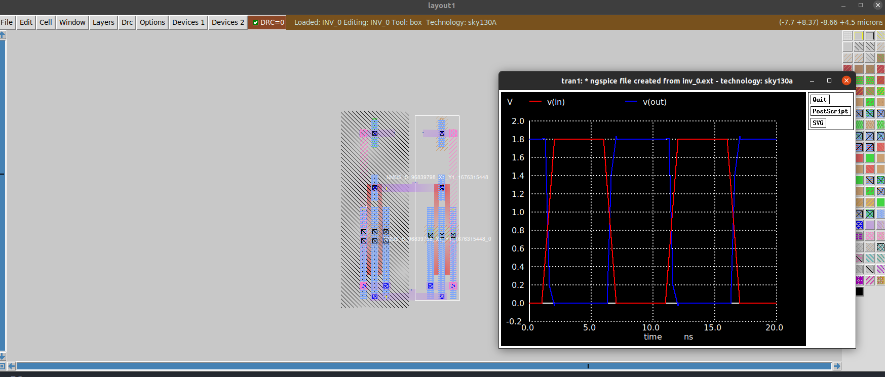

ALIGN Generated .gdb and .lef in ```klayout```

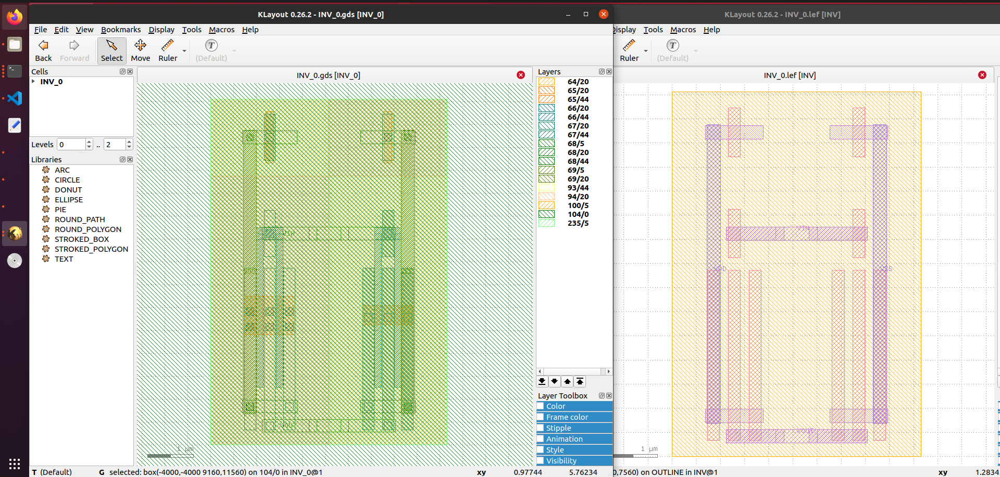

### Comparison of Pre-layout and Post-layout Simulation inverter
| Parameter    | Value from Pre-layout Simulation| Value from Post-layout Simulation|
|----------|-----|-----|
|Rise Time|||
|Fall Time|||
|Cell Rise Delay|||
|Cell Fall Delay|||


### LVS Report Inverter post-layout characterization
The layout vs schematic compares the pre-layout netlist with the netlist extracted from the layout. The mismatch is due to the extra parasitic capacitances in the post-layout netlist. The report ```comp.out``` is obtained using Netgen by typing the following command.

```
netgen -batch lvs INV_0.spice INV.spice
```

Circuit 1 cell sky130_fd_pr__nfet_01v8 and Circuit 2 cell sky130_fd_pr__nfet_01v8 are black boxes.<br>
Equate elements:  no current cell.<br>
Device classes sky130_fd_pr__nfet_01v8 and sky130_fd_pr__nfet_01v8 are equivalent.

Netlists do not match.<br>
Cells have no pins;  pin matching not needed.<br>
Device classes INV_0.spice and INV.spice are equivalent.<br>

Final result: Netlists do not match.


## Design pre-layout using xschem/ngspice using SKY130 PDKS

### Pre-Layout Simulation Of a Function
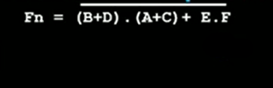

### Xschem Circuit and Simulation
|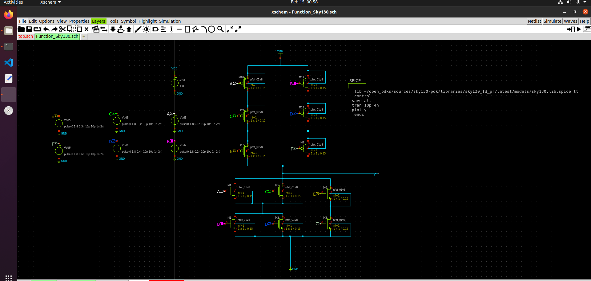|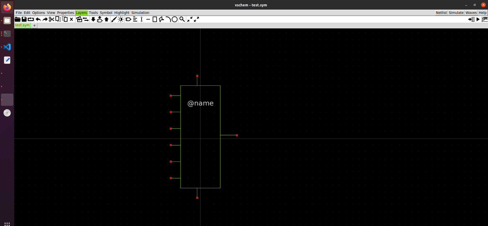    |
|-----|----|
|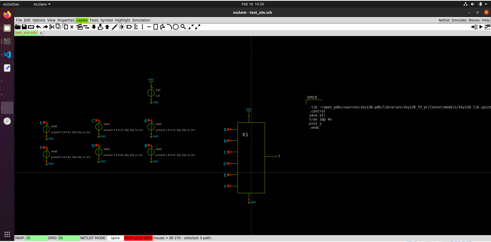|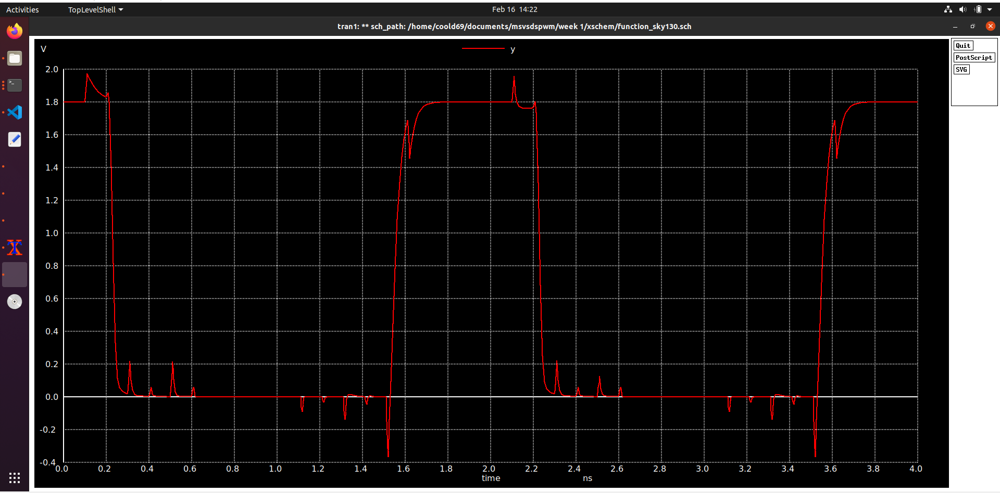|

## Post layout characterization using magic/ngspice and SKY130 PDKs (xschem technique)

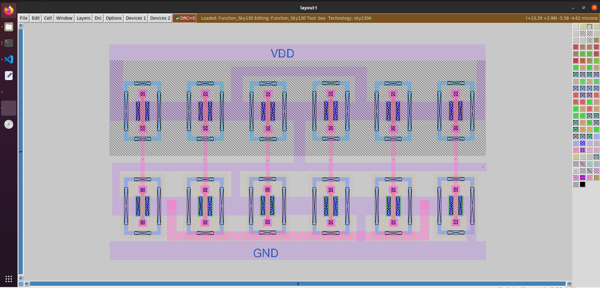

#### Netlist
Magic Tool Generated Netlist
```
* For spice netlist goto ./Week 1/Function_W=1_L=0.15/Post_Layout/Function_Sky130.spice
```
Ngspice Simulation
```
ngspice Function_Sky130.spice
```
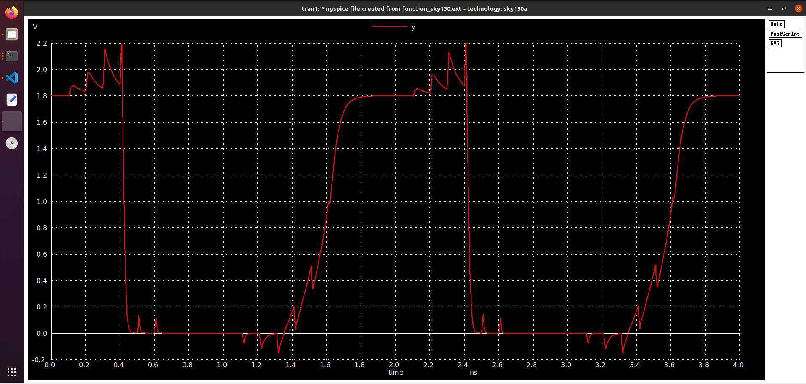


### Comparison of Pre-layout and Post-layout Simulation Function Magic/Xschem


### LVS Report Function Magic/Xschem
The layout vs schematic compares the pre-layout netlist with the netlist extracted from the layout. The mismatch is due to the extra parasitic capacitances in the post-layout netlist. The report ```comp.out``` is obtained using Netgen by typing the following command.

## Post layout characterization using ALIGN 

### Xschem Circuit Diagram

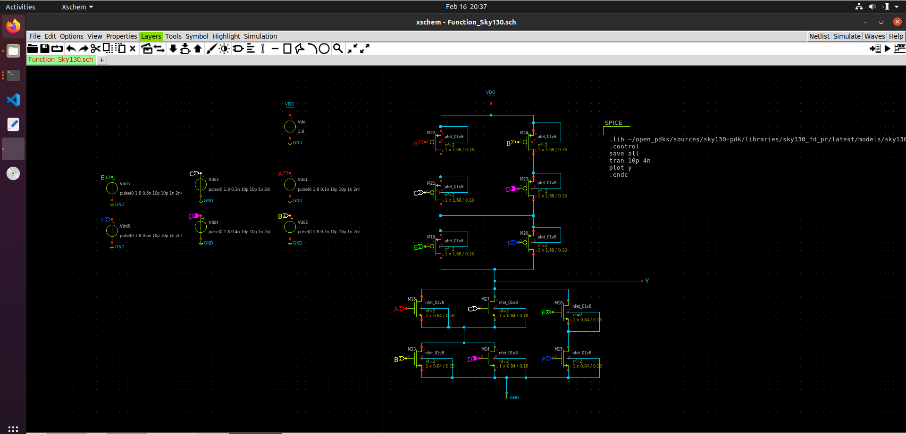

#### Simulation
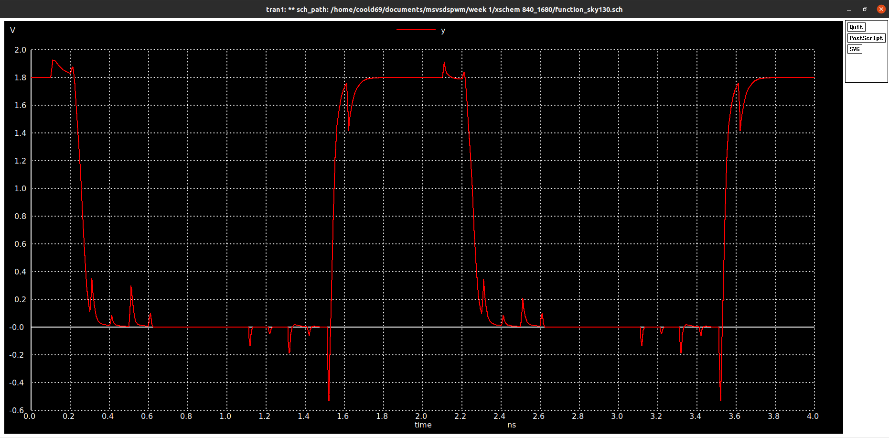

ALIGN Input Netlist
```
.subckt Function_Sky130 F E D C B A VDD VSS Y

XM13 net2 B VSS VSS sky130_fd_pr__nfet_01v8 L=180n W=840n nf=2
XM14 net2 D VSS VSS sky130_fd_pr__nfet_01v8 L=180n W=840n nf=2
XM15 net1 F VSS VSS sky130_fd_pr__nfet_01v8 L=180n W=840n nf=2
XM16 Y A net2 net2 sky130_fd_pr__nfet_01v8 L=180n W=840n nf=2
XM17 Y C net2 net2 sky130_fd_pr__nfet_01v8 L=180n W=840n nf=2
XM18 Y E net1 net1 sky130_fd_pr__nfet_01v8 L=180n W=840n nf=2
XM19 Y E net3 net3 sky130_fd_pr__pfet_01v8 L=180n W=1680n nf=2
XM20 Y F net3 net3 sky130_fd_pr__pfet_01v8 L=180n W=1680n nf=2
XM21 net3 C net4 net4 sky130_fd_pr__pfet_01v8 L=180n W=1680n nf=2
XM22 net4 A VDD VDD sky130_fd_pr__pfet_01v8 L=180n W=1680n nf=2
XM23 net3 D net5 net5 sky130_fd_pr__pfet_01v8 L=180n W=1680n nf=2
XM24 net5 B VDD VDD sky130_fd_pr__pfet_01v8 L=180n W=1680n nf=2

.ends Function_Sky130

```

### Pre Layout Simulation ALIGN 
For view The Full Netlist Click Here👇
<details><summary>Netlist:</summary>

```
Vdd VDD GND 1.8
.save i(vdd)
Vdd1 A GND pulse(0 1.8 0.1n 10p 10p 1n 2n)
.save i(vdd1)
Vdd2 B GND pulse(0 1.8 0.2n 10p 10p 1n 2n)
.save i(vdd2)
Vdd3 C GND pulse(0 1.8 0.3n 10p 10p 1n 2n)
.save i(vdd3)
Vdd4 D GND pulse(0 1.8 0.4n 10p 10p 1n 2n)
.save i(vdd4)
Vdd5 E GND pulse(0 1.8 0.5n 10p 10p 1n 2n)
.save i(vdd5)
Vdd6 F GND pulse(0 1.8 0.6n 10p 10p 1n 2n)
.save i(vdd6)
X1 F E D C B A VDD GND Y Function_Sky130
**** begin user architecture code

.lib ~/open_pdks/sources/sky130-pdk/libraries/sky130_fd_pr/latest/models/sky130.lib.spice tt
.control
save all
tran 10p 4n
plot y
.endc

**** end user architecture code
**.ends


.subckt Function_Sky130 F E D C B A VDD VSS Y

XM13 net2 B VSS VSS sky130_fd_pr__nfet_01v8 L=0.18 W=0.84 nf=2
XM14 net2 D VSS VSS sky130_fd_pr__nfet_01v8 L=0.18 W=0.84 nf=2
XM15 net1 F VSS VSS sky130_fd_pr__nfet_01v8 L=0.18 W=0.84 nf=2
XM16 Y A net2 net2 sky130_fd_pr__nfet_01v8 L=0.18 W=0.84 nf=2
XM17 Y C net2 net2 sky130_fd_pr__nfet_01v8 L=0.18 W=0.84 nf=2
XM18 Y E net1 net1 sky130_fd_pr__nfet_01v8 L=0.18 W=0.84 nf=2
XM19 Y E net3 net3 sky130_fd_pr__pfet_01v8 L=0.18 W=1.68 nf=2
XM20 Y F net3 net3 sky130_fd_pr__pfet_01v8 L=0.18 W=1.68 nf=2
XM21 net3 C net4 net4 sky130_fd_pr__pfet_01v8 L=0.18 W=1.68 nf=2
XM22 net4 A VDD VDD sky130_fd_pr__pfet_01v8 L=0.18 W=1.68 nf=2
XM23 net3 D net5 net5 sky130_fd_pr__pfet_01v8 L=0.18 W=1.68 nf=2
XM24 net5 B VDD VDD sky130_fd_pr__pfet_01v8 L=0.15 W=1.68 nf=2
.ends Function_Sky130

```
</details><br>

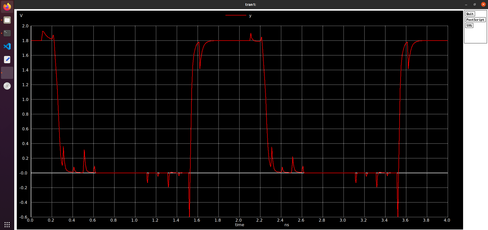


### ALIGN Generated Layout
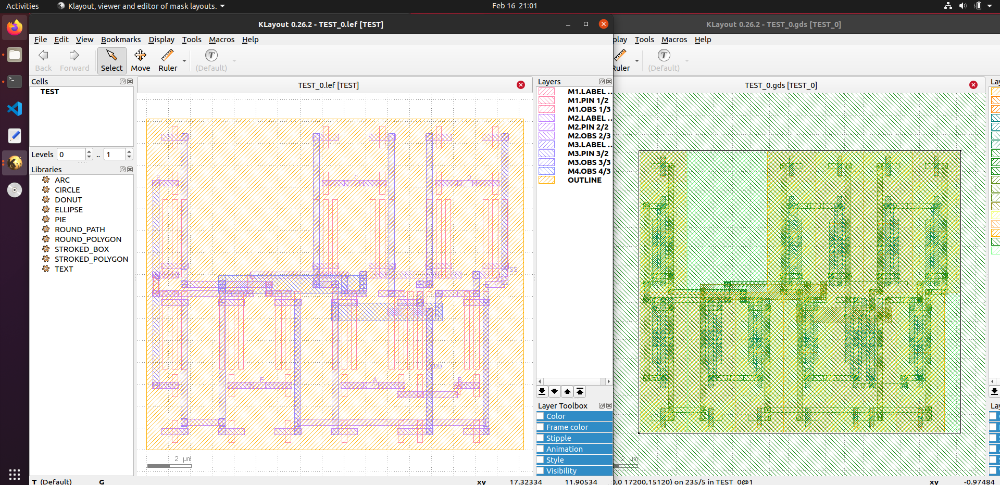

### ALIGN Generated Layout in Magic
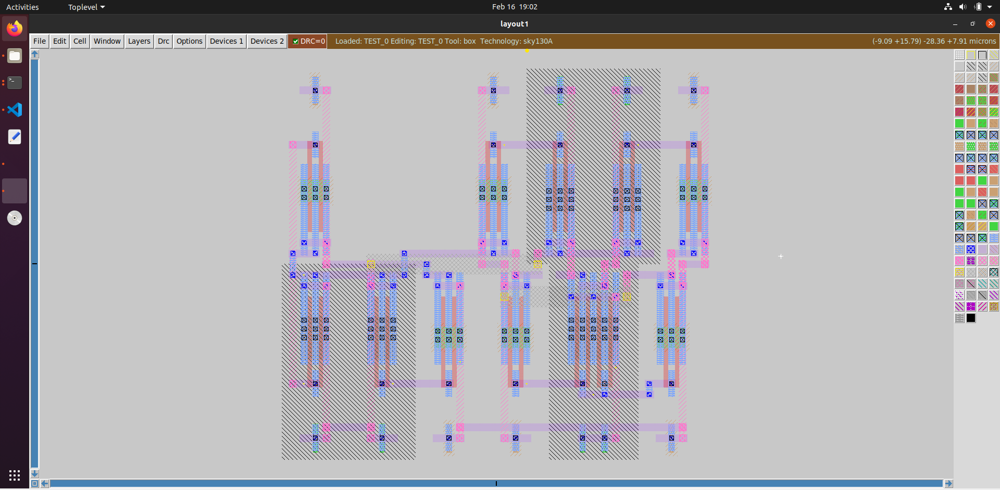

### Generated Netlist From Magic Layout

```
extract do local
excract all
ext2spice hierarchy on
ext2spice scale off
ext2spice cthresh 0 rthresh 0
ext2spice 
```

### Magic Generated Netlist

For view The Full Netlist Click Here👇
<details><summary>Netlist</summary>

```
* NGSPICE file created from TEST_0.ext - technology: sky130A

.subckt PMOS_S_95137167_X1_Y1_1676553145_1676553145 a_200_252# a_230_399# w_0_0#
X0 a_230_399# a_200_252# w_0_0# w_0_0# sky130_fd_pr__pfet_01v8 ad=4.704e+11p pd=3.92e+06u as=8.904e+11p ps=7.78e+06u w=1.68e+06u l=150000u
X1 w_0_0# a_200_252# a_230_399# w_0_0# sky130_fd_pr__pfet_01v8 ad=0p pd=0u as=0p ps=0u w=1.68e+06u l=150000u
C0 a_230_399# w_0_0# 0.78fF
C1 w_0_0# a_200_252# 0.66fF
C2 a_230_399# a_200_252# 0.10fF
C3 a_230_399# VSUBS -0.03fF
C4 a_200_252# VSUBS 0.06fF
C5 w_0_0# VSUBS 2.97fF
.ends

.subckt NMOS_S_54129001_X1_Y1_1676553144_1676553145 a_200_252# a_230_483# a_147_483#
X0 a_230_483# a_200_252# a_147_483# a_147_483# sky130_fd_pr__nfet_01v8 ad=2.352e+11p pd=2.24e+06u as=4.452e+11p ps=4.42e+06u w=840000u l=150000u
X1 a_147_483# a_200_252# a_230_483# a_147_483# sky130_fd_pr__nfet_01v8 ad=0p pd=0u as=0p ps=0u w=840000u l=150000u
C0 a_200_252# a_230_483# 0.11fF
C1 a_230_483# a_147_483# 0.74fF
C2 a_200_252# a_147_483# 0.89fF
.ends

.subckt INV_45746474_0_0_1676553145 PMOS_S_95137167_X1_Y1_1676553145_1676553145_0/w_0_0#
+ m1_398_560# li_405_1411# VSUBS
XPMOS_S_95137167_X1_Y1_1676553145_1676553145_0 m1_398_560# li_405_1411# PMOS_S_95137167_X1_Y1_1676553145_1676553145_0/w_0_0#
+ PMOS_S_95137167_X1_Y1_1676553145_1676553145
XNMOS_S_54129001_X1_Y1_1676553144_1676553145_0 m1_398_560# li_405_1411# VSUBS NMOS_S_54129001_X1_Y1_1676553144_1676553145
C0 li_405_1411# PMOS_S_95137167_X1_Y1_1676553145_1676553145_0/w_0_0# 0.06fF
C1 PMOS_S_95137167_X1_Y1_1676553145_1676553145_0/w_0_0# m1_398_560# 0.28fF
C2 li_405_1411# m1_398_560# 0.15fF
C3 li_405_1411# VSUBS 0.69fF
C4 m1_398_560# VSUBS 1.53fF
C5 PMOS_S_95137167_X1_Y1_1676553145_1676553145_0/w_0_0# VSUBS 3.02fF
.ends

.subckt DP_PMOS_83764739_X1_Y1_1676553146 a_372_252# a_200_252# a_230_399# a_402_399#
+ w_0_0#
X0 w_0_0# a_372_252# a_402_399# w_0_0# sky130_fd_pr__pfet_01v8 ad=1.3608e+12p pd=1.17e+07u as=4.704e+11p ps=3.92e+06u w=1.68e+06u l=150000u
X1 a_230_399# a_200_252# w_0_0# w_0_0# sky130_fd_pr__pfet_01v8 ad=4.704e+11p pd=3.92e+06u as=0p ps=0u w=1.68e+06u l=150000u
X2 w_0_0# a_200_252# a_230_399# w_0_0# sky130_fd_pr__pfet_01v8 ad=0p pd=0u as=0p ps=0u w=1.68e+06u l=150000u
X3 a_402_399# a_372_252# w_0_0# w_0_0# sky130_fd_pr__pfet_01v8 ad=0p pd=0u as=0p ps=0u w=1.68e+06u l=150000u
C0 a_200_252# a_230_399# 0.10fF
C1 a_230_399# w_0_0# 0.72fF
C2 a_200_252# a_402_399# 0.01fF
C3 a_372_252# a_402_399# 0.10fF
C4 a_402_399# w_0_0# 0.91fF
C5 a_200_252# a_372_252# 0.21fF
C6 a_230_399# a_402_399# 0.06fF
C7 a_200_252# w_0_0# 0.56fF
C8 a_372_252# w_0_0# 0.57fF
C9 a_402_399# VSUBS -0.05fF
C10 a_230_399# VSUBS -0.10fF
C11 a_372_252# VSUBS 0.04fF
C12 a_200_252# VSUBS -0.00fF
C13 w_0_0# VSUBS 3.45fF
.ends

.subckt NMOS_S_54129001_X1_Y1_1676553147 a_200_252# a_230_483# a_147_483#
X0 a_230_483# a_200_252# a_147_483# a_147_483# sky130_fd_pr__nfet_01v8 ad=2.352e+11p pd=2.24e+06u as=4.452e+11p ps=4.42e+06u w=840000u l=150000u
X1 a_147_483# a_200_252# a_230_483# a_147_483# sky130_fd_pr__nfet_01v8 ad=0p pd=0u as=0p ps=0u w=840000u l=150000u
C0 a_230_483# a_200_252# 0.11fF
C1 a_230_483# a_147_483# 0.74fF
C2 a_200_252# a_147_483# 0.89fF
.ends

.subckt PMOS_S_95137167_X1_Y1_1676553148 a_200_252# a_230_399# w_0_0#
X0 a_230_399# a_200_252# w_0_0# w_0_0# sky130_fd_pr__pfet_01v8 ad=4.704e+11p pd=3.92e+06u as=8.904e+11p ps=7.78e+06u w=1.68e+06u l=150000u
X1 w_0_0# a_200_252# a_230_399# w_0_0# sky130_fd_pr__pfet_01v8 ad=0p pd=0u as=0p ps=0u w=1.68e+06u l=150000u
C0 a_200_252# a_230_399# 0.10fF
C1 a_200_252# w_0_0# 0.66fF
C2 a_230_399# w_0_0# 0.78fF
C3 a_230_399# VSUBS -0.03fF
C4 a_200_252# VSUBS 0.06fF
C5 w_0_0# VSUBS 2.97fF
.ends

.subckt TEST_0 F E D C B A VDD VSS Y
XINV_45746474_0_0_1676553145_0 m1_312_224# E Y VSS INV_45746474_0_0_1676553145
XDP_PMOS_83764739_X1_Y1_1676553146_0 li_2813_487# m1_1978_560# VDD VDD VDD DP_PMOS_83764739_X1_Y1_1676553146
XNMOS_S_54129001_X1_Y1_1676553147_0 m1_1806_2408# Y VSS NMOS_S_54129001_X1_Y1_1676553147
XPMOS_S_95137167_X1_Y1_1676553148_0 m1_2838_2408# m1_312_224# VDD PMOS_S_95137167_X1_Y1_1676553148
XNMOS_S_54129001_X1_Y1_1676553147_1 m1_1978_560# Y VSS NMOS_S_54129001_X1_Y1_1676553147
XPMOS_S_95137167_X1_Y1_1676553148_1 C m1_312_224# VDD PMOS_S_95137167_X1_Y1_1676553148
XNMOS_S_54129001_X1_Y1_1676553147_2 F VSS VSS NMOS_S_54129001_X1_Y1_1676553147
XNMOS_S_54129001_X1_Y1_1676553147_3 D VSS VSS NMOS_S_54129001_X1_Y1_1676553147
XPMOS_S_95137167_X1_Y1_1676553148_2 m1_946_560# Y m1_312_224# PMOS_S_95137167_X1_Y1_1676553148
XNMOS_S_54129001_X1_Y1_1676553147_4 B VSS VSS NMOS_S_54129001_X1_Y1_1676553147
C0 E F 0.03fF
C1 li_2813_487# m1_312_224# 0.00fF
C2 B m1_312_224# 0.00fF
C3 Y C 0.00fF
C4 Y m1_1806_2408# 0.00fF
C5 Y F 0.01fF
C6 D B 0.00fF
C7 Y A 0.01fF
C8 m1_2838_2408# m1_1806_2408# 0.00fF
C9 D m1_312_224# 0.00fF
C10 B F 0.00fF
C11 m1_312_224# C 0.01fF
C12 B A 0.00fF
C13 m1_312_224# m1_1806_2408# 0.00fF
C14 F m1_312_224# 0.26fF
C15 m1_312_224# A 0.00fF
C16 D C 0.03fF
C17 m1_1978_560# m1_946_560# 0.00fF
C18 Y VDD 0.07fF
C19 A C 0.00fF
C20 F A 0.03fF
C21 Y m1_946_560# 0.00fF
C22 li_2813_487# VDD 0.01fF
C23 B VDD 0.26fF
C24 VDD m1_312_224# 1.60fF
C25 m1_312_224# m1_946_560# 0.00fF
C26 D VDD 0.15fF
C27 VDD C 0.24fF
C28 F VDD 0.00fF
C29 VDD A 0.18fF
C30 E Y 0.04fF
C31 li_2813_487# m1_1978_560# 0.00fF
C32 E m1_312_224# 0.04fF
C33 m1_1978_560# m1_312_224# 0.00fF
C34 E C 0.01fF
C35 Y m1_312_224# 0.65fF
C37 B VSS 0.46fF
C38 m1_946_560# VSS 0.14fF
C39 D VSS 0.56fF
C40 F VSS 0.38fF
C41 C VSS -0.44fF
C42 m1_2838_2408# VSS 0.15fF
C43 m1_1806_2408# VSS 0.97fF
C44 VDD VSS 9.73fF
C45 li_2813_487# VSS 0.28fF
C46 m1_1978_560# VSS 0.98fF
C47 Y VSS 2.89fF
C48 E VSS 1.17fF
C49 m1_312_224# VSS 4.53fF
.ends


Vdd VDD GND 1.8
.save i(vdd)
Vdd1 A GND pulse(0 1.8 0.1n 10p 10p 1n 2n)
.save i(vdd1)
Vdd2 B GND pulse(0 1.8 0.2n 10p 10p 1n 2n)
.save i(vdd2)
Vdd3 C GND pulse(0 1.8 0.3n 10p 10p 1n 2n)
.save i(vdd3)
Vdd4 D GND pulse(0 1.8 0.4n 10p 10p 1n 2n)
.save i(vdd4)
Vdd5 E GND pulse(0 1.8 0.5n 10p 10p 1n 2n)
.save i(vdd5)
Vdd6 F GND pulse(0 1.8 0.6n 10p 10p 1n 2n)
.save i(vdd6)
X1 F E D C B A VDD GND Y  TEST_0
**** begin user architecture code


.lib ~/open_pdks/sources/sky130-pdk/libraries/sky130_fd_pr/latest/models/sky130.lib.spice tt
.control
save all
tran 10p 4n
set color0=rgb:f/f/f
set color1=rgb:0/0/0
plot y
.endc

**** end user architecture code
**.ends

```

</details><br>

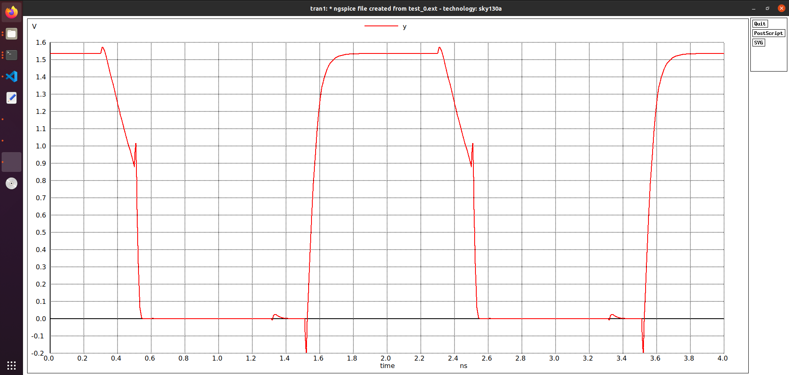
### Magic Generated Netlist without parasitic

For view The Full Netlist Click Here👇
<details><summary>Netlist</summary>

```
* NGSPICE file created from TEST_0.ext - technology: sky130A

.subckt PMOS_S_95137167_X1_Y1_1676553145_1676553145 a_200_252# a_230_399# w_0_0#
X0 a_230_399# a_200_252# w_0_0# w_0_0# sky130_fd_pr__pfet_01v8 ad=4.704e+11p pd=3.92e+06u as=8.904e+11p ps=7.78e+06u w=1.68e+06u l=150000u
X1 w_0_0# a_200_252# a_230_399# w_0_0# sky130_fd_pr__pfet_01v8 ad=0p pd=0u as=0p ps=0u w=1.68e+06u l=150000u
.ends

.subckt NMOS_S_54129001_X1_Y1_1676553144_1676553145 a_200_252# a_230_483# a_147_483#
X0 a_230_483# a_200_252# a_147_483# a_147_483# sky130_fd_pr__nfet_01v8 ad=2.352e+11p pd=2.24e+06u as=4.452e+11p ps=4.42e+06u w=840000u l=150000u
X1 a_147_483# a_200_252# a_230_483# a_147_483# sky130_fd_pr__nfet_01v8 ad=0p pd=0u as=0p ps=0u w=840000u l=150000u
.ends

.subckt INV_45746474_0_0_1676553145 PMOS_S_95137167_X1_Y1_1676553145_1676553145_0/w_0_0#
+ m1_398_560# li_405_1411# VSUBS
XPMOS_S_95137167_X1_Y1_1676553145_1676553145_0 m1_398_560# li_405_1411# PMOS_S_95137167_X1_Y1_1676553145_1676553145_0/w_0_0#
+ PMOS_S_95137167_X1_Y1_1676553145_1676553145
XNMOS_S_54129001_X1_Y1_1676553144_1676553145_0 m1_398_560# li_405_1411# VSUBS NMOS_S_54129001_X1_Y1_1676553144_1676553145
.ends

.subckt DP_PMOS_83764739_X1_Y1_1676553146 a_372_252# a_200_252# a_230_399# a_402_399#
+ w_0_0#
X0 w_0_0# a_372_252# a_402_399# w_0_0# sky130_fd_pr__pfet_01v8 ad=1.3608e+12p pd=1.17e+07u as=4.704e+11p ps=3.92e+06u w=1.68e+06u l=150000u
X1 a_230_399# a_200_252# w_0_0# w_0_0# sky130_fd_pr__pfet_01v8 ad=4.704e+11p pd=3.92e+06u as=0p ps=0u w=1.68e+06u l=150000u
X2 w_0_0# a_200_252# a_230_399# w_0_0# sky130_fd_pr__pfet_01v8 ad=0p pd=0u as=0p ps=0u w=1.68e+06u l=150000u
X3 a_402_399# a_372_252# w_0_0# w_0_0# sky130_fd_pr__pfet_01v8 ad=0p pd=0u as=0p ps=0u w=1.68e+06u l=150000u
.ends

.subckt NMOS_S_54129001_X1_Y1_1676553147 a_200_252# a_230_483# a_147_483#
X0 a_230_483# a_200_252# a_147_483# a_147_483# sky130_fd_pr__nfet_01v8 ad=2.352e+11p pd=2.24e+06u as=4.452e+11p ps=4.42e+06u w=840000u l=150000u
X1 a_147_483# a_200_252# a_230_483# a_147_483# sky130_fd_pr__nfet_01v8 ad=0p pd=0u as=0p ps=0u w=840000u l=150000u
C0 a_230_483# a_200_252# 0.11fF
.ends

.subckt PMOS_S_95137167_X1_Y1_1676553148 a_200_252# a_230_399# w_0_0#
X0 a_230_399# a_200_252# w_0_0# w_0_0# sky130_fd_pr__pfet_01v8 ad=4.704e+11p pd=3.92e+06u as=8.904e+11p ps=7.78e+06u w=1.68e+06u l=150000u
X1 w_0_0# a_200_252# a_230_399# w_0_0# sky130_fd_pr__pfet_01v8 ad=0p pd=0u as=0p ps=0u w=1.68e+06u l=150000u
.ends

.subckt TEST_0 F E D C B A VDD VSS Y
XINV_45746474_0_0_1676553145_0 m1_312_224# E Y VSS INV_45746474_0_0_1676553145
XDP_PMOS_83764739_X1_Y1_1676553146_0 li_2813_487# m1_1978_560# VDD VDD VDD DP_PMOS_83764739_X1_Y1_1676553146
XNMOS_S_54129001_X1_Y1_1676553147_0 m1_1806_2408# Y VSS NMOS_S_54129001_X1_Y1_1676553147
XPMOS_S_95137167_X1_Y1_1676553148_0 m1_2838_2408# m1_312_224# VDD PMOS_S_95137167_X1_Y1_1676553148
XNMOS_S_54129001_X1_Y1_1676553147_1 m1_1978_560# Y VSS NMOS_S_54129001_X1_Y1_1676553147
XPMOS_S_95137167_X1_Y1_1676553148_1 C m1_312_224# VDD PMOS_S_95137167_X1_Y1_1676553148
XNMOS_S_54129001_X1_Y1_1676553147_2 F VSS VSS NMOS_S_54129001_X1_Y1_1676553147
XNMOS_S_54129001_X1_Y1_1676553147_3 D VSS VSS NMOS_S_54129001_X1_Y1_1676553147
XPMOS_S_95137167_X1_Y1_1676553148_2 m1_946_560# Y m1_312_224# PMOS_S_95137167_X1_Y1_1676553148
XNMOS_S_54129001_X1_Y1_1676553147_4 B VSS VSS NMOS_S_54129001_X1_Y1_1676553147
.ends


Vdd VDD GND 1.8
.save i(vdd)
Vdd1 A GND pulse(0 1.8 0.1n 10p 10p 1n 2n)
.save i(vdd1)
Vdd2 B GND pulse(0 1.8 0.2n 10p 10p 1n 2n)
.save i(vdd2)
Vdd3 C GND pulse(0 1.8 0.3n 10p 10p 1n 2n)
.save i(vdd3)
Vdd4 D GND pulse(0 1.8 0.4n 10p 10p 1n 2n)
.save i(vdd4)
Vdd5 E GND pulse(0 1.8 0.5n 10p 10p 1n 2n)
.save i(vdd5)
Vdd6 F GND pulse(0 1.8 0.6n 10p 10p 1n 2n)
.save i(vdd6)
X1 F E D C B A VDD GND Y  TEST_0
**** begin user architecture code


.lib ~/open_pdks/sources/sky130-pdk/libraries/sky130_fd_pr/latest/models/sky130.lib.spice tt
.control
save all
tran 10p 4n
set color0=rgb:f/f/f
set color1=rgb:0/0/0
plot y
.endc

```

</details><br>

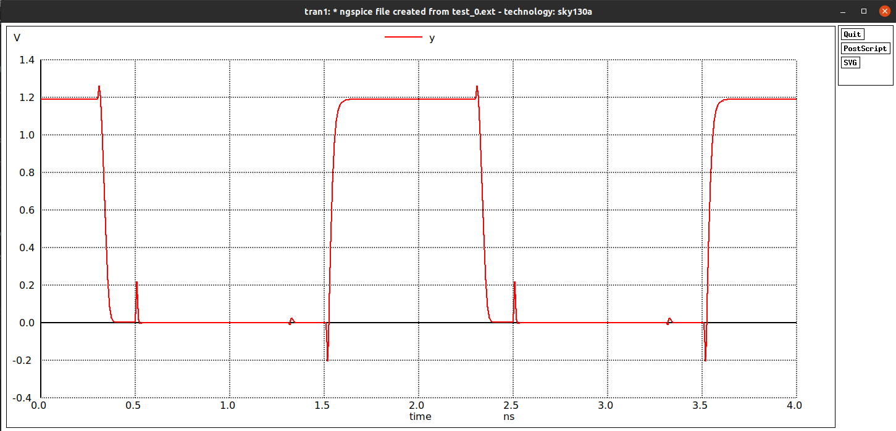


### Comparison


### LVS Report ALIGN MAGIC
The layout vs schematic compares the pre-layout netlist with the netlist extracted from the layout. The report comp.out is obtained using Netgen.

Netlists do not match.
Cells have no pins;  pin matching not needed.
Device classes Function_Sky130.spice and Function_Sky1302.spice are equivalent.

Final result: Netlists do not match.


#### Another ALIGN Layout
For view The Full Netlist Click Here👇
<details><summary>Netlist</summary>

```
.subckt Function_Sky130_New F E D C B A VDD VSS Y
XM13 net2 B VSS VSS sky130_fd_pr__nfet_01v8 L=150n W=1000n nf=2
XM14 net2 D VSS VSS sky130_fd_pr__nfet_01v8 L=150n W=1000n nf=2
XM15 net1 F VSS VSS sky130_fd_pr__nfet_01v8 L=150n W=1000n nf=2
XM16 Y A net2 net2 sky130_fd_pr__nfet_01v8 L=150n W=1000n nf=2
XM17 Y C net2 net2 sky130_fd_pr__nfet_01v8 L=150n W=1000n nf=2
XM18 Y E net1 net1 sky130_fd_pr__nfet_01v8 L=150n W=1000n nf=2
XM19 Y E net3 net3 sky130_fd_pr__pfet_01v8 L=150n W=1680n nf=2
XM20 Y F net3 net3 sky130_fd_pr__pfet_01v8 L=150n W=1680n nf=2
XM21 net3 C net4 net4 sky130_fd_pr__pfet_01v8 L=150n W=1680n nf=2
XM22 net4 A VDD VDD sky130_fd_pr__pfet_01v8 L=150n W=1680n nf=2
XM23 net3 D net5 net5 sky130_fd_pr__pfet_01v8 L=150n W=1680n nf=2
XM24 net5 B VDD VDD sky130_fd_pr__pfet_01v8 L=150n W=1680n nf=2
.ends Function_Sky130_New
```

</details><br>

#### klayout View .gds / .lef

|.gds|.lef|
|-|-|
|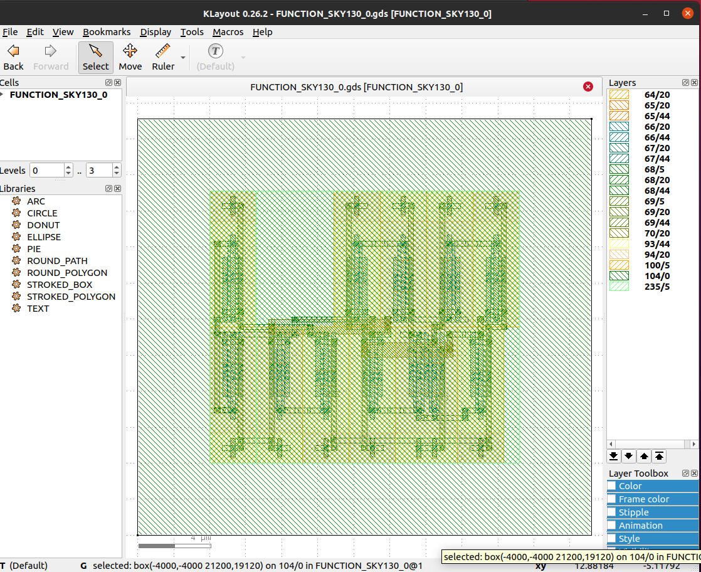 |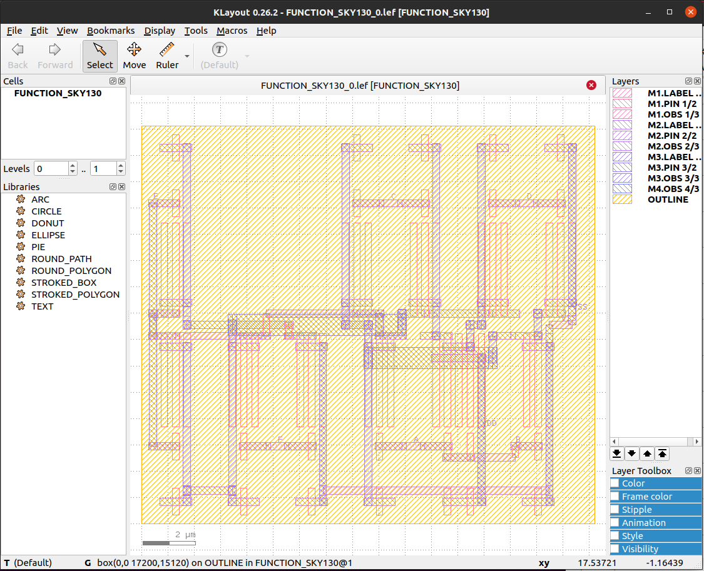 |

Magic View
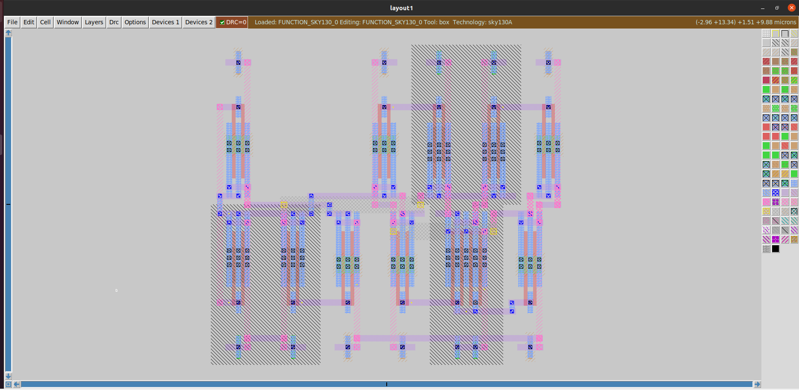


# Week 2
## Index
- [OpenRoad Installation](#openroad-installation)
- [Install OpenFASoC](#install-openfasoc)
- [OpenFASoC: Temperature Sensor Generator](#openfasoc-temperature-sensor-generator)
    * [Temperature Sensor Auxiliary Cells](#temperature-sensor-auxiliary-cells)
        + [Circuit](#circuit)
    * [OpenFASOC flow for Temperature Sensor Generation](#openfasoc-flow-for-temperature-sensor-generation)
    * [Verilog generation](#verilog-generation)
    * [Synthesis](#synthesis)
    * [Floorplan](#floorplan)
    * [Placement](#placement)
    * [Routing](#routing)
    * [Final Layout after Routing]()
- [Jupyter NoteBook Temperature Sensor]()
    * [Generator Flow images](#generator-flow-images)


### OpenRoad Installation
OpenROAD is an integrated chip physical design tool that takes a design from synthesized Verilog to routed layout.

An outline of steps used to build a chip using OpenROAD is shown below:

1. Initialize floorplan - define the chip size and cell rows
2. Place pins (for designs without pads )
3. Place macro cells (RAMs, embedded macros)
4. Insert substrate tap cells
5. Insert power distribution network
6. Macro Placement of macro cells
7. Global placement of standard cells
8. Repair max slew, max capacitance, and max fanout violations and long wires
9. Clock tree synthesis
10. Optimize setup/hold timing
11. Insert fill cells
12. Global routing (route guides for detailed routing)
13. Antenna repair
14. Detailed routing
15. Parasitic extraction
16. Static timing analysis

Before Installing openROAD lemon needs to be instal First
https://lemon.cs.elte.hu/trac/lemon/wiki/Downloads

Run the below commands step-by-step
```bash
cd
git clone --recursive https://github.com/The-OpenROAD-Project/OpenROAD.git
cd OpenROAD
./etc/DependencyInstaller.sh
cd
git clone --recursive https://github.com/The-OpenROAD-Project/OpenROAD-flow-scripts
cd OpenROAD-flow-scripts
./build_openroad.sh –local
export OPENROAD=~/OpenROAD-flow-scripts/tools/OpenROAD
export PATH=~/OpenROAD-flow-scripts/tools/install/OpenROAD/bin:~/OpenROAD-flow-scripts/tools/install/yosys/bin:~/OpenROAD-flow-scripts/tools/install/LSOracle/bin:$PATH

```
### Install OpenFASoC
To install the OpenFASoC use the following commands
```
cd
git clone https://github.com/idea-fasoc/openfasoc
cd openfasoc
./dependencies.sh
```
## OpenFASoC: Temperature Sensor Generator
## Temperature Sensor Auxiliary Cells
An overview of how the Temperature Sensor Generator (temp-sense-gen) works internally in OpenFASoC

### Circuit
This generator creates a compact mixed-signal temperature sensor based on the topology from this paper. It consists of a ring oscillator whose frequency is controlled by the voltage drop over a MOSFET operating in subthreshold regime, where its dependency on temperature is exponential.


The physical implementation of the analog blocks in the circuit is done using two manually designed standard cells:

1. HEADER cell, containing the transistors in subthreshold operation;

2. SLC cell, containing the Split-Control Level Converter.

The gds and lef files of HEADER and SLC cells are pre-created before the start of the Generator flow.


The layout of the HEADER cell is shown below:


The layout of the SLC cell is shown below:


### OpenFASOC flow for Temperature Sensor Generation

To configure circuit specifications, modify the test.json specfile in the ```openfasoc/generators/temp-sense-gen/``` folder.

To run the default generator, cd into ```openfasoc/generators/temp-sense-gen/``` and execute the following command:

First Initialised open_pdk root

```
export PDK_ROOT=/usr/local/share/pdk
make sky130hd_temp
```

The default circuit’s physical design generation can be divided into three parts:

1. Verilog generation

2. RTL-to-GDS flow (OpenROAD)

3. Post-layout verification (DRC and LVS)


### Verilog generation

To run verilog generation
```
 make sky130hd_temp_verilog
```

The test.json file shown in the below screenshot corresponds to the temp_sense_gen.


The generator references the model file in an iterative process until either meeting specifications or failing.


### Synthesis
The OpenROAD Flow starts with a flow configuration file config.mk, the chosen platform (sky130hd, for example) and the Verilog files are generated from the previous part.

To Run the synthesis 
```bash
export PDK_ROOT=/usr/local/share/pdk
make sky130hd_temp
```
If will get some OpenROAD path error:
```bash
export OPENROAD=~/OpenROAD-flow-scripts/tools/OpenROAD
export PATH=~/OpenROAD-flow-scripts/tools/install/OpenROAD/bin:~/OpenROAD-flow-scripts/tools/install/yosys/bin:~/OpenROAD-flow-scripts/tools/install/LSOracle/bin:$PATH
export PDK_ROOT=/usr/local/share/pdk
```
This commands are initialised OpenROAD along with open_pdks path.

The config.mk file is shown below:


The systhesis verilog codes in
```/openfasoc/openfasoc/generators/temp-sense-gen/flow/results/sky130hd/tempsense```


### Floorplan
The floorplan for the physical design is generated with OpenROAD, which requires a description of the power delivery network in pdn.cfg.

The floorplan final power report is shown below:


This temperature sensor design implements two voltage domains: one for the VDD that powers most of the circuit, and another for the VIN that powers the ring oscillator and is an output of the HEADER cells. Such voltage domains are created within the floorplan.tcl script, with the following lines of code:


### Placement
Placement takes place after the floorplan is ready and has two phases: global placement and detailed placement. The output of this phase will have all instances placed in their corresponding voltage domain, ready for routing.


###  Routing
Routing is also divided into two phases: global routing and detailed routing. Right before global routing, OpenFASoC calls ```/openfasoc/openfasoc/generators/temp-sense-gen/flow/scripts/openfasocpre_global_route.tcl```:


Power Delivery Network:


### Final Layout after Routing


## Jupyter NoteBook Temperature Sensor

[](/Week%202/Temperature_Sensor_Google_Collab/OpenFASoC.ipynb)
<a href="" target="_parent"></a>

See NoteBook [here](/Week%202/Temperature_Sensor_Google_Collab/OpenFASoC.ipynb)


### Generator Flow images


   


# Week 3

## Index


## Pre-Layout

### Prelayout Circuit in Xschem

#### With capacitor


#### Subcircuit Wrapper


#### Simulation

For view The Full Netlist Here👇
<details><summary>Netlist</summary>

```
** sch_path: /home/coold69/Documents/msvsdspwm/Week 3/xschem/analog_tb.sch
**.subckt analog_tb
X1 VN VP Y analog
V1 VP VN 1.8
.save i(v1)
**** begin user architecture code


.lib ~/open_pdks/sources/sky130-pdk/libraries/sky130_fd_pr/latest/models/sky130.lib.spice tt
.control
save all
tran 1u 0.001
plot v(y)
.endc

**** end user architecture code
**.ends

* expanding   symbol:  analog.sym # of pins=3
** sym_path: /home/coold69/Documents/msvsdspwm/Week 3/xschem/analog.sym
** sch_path: /home/coold69/Documents/msvsdspwm/Week 3/xschem/analog.sch
.subckt analog VN VP Y
*.iopin VP
*.iopin VN
*.opin Y
XM2 net1 Y VP VP sky130_fd_pr__pfet_01v8 L=0.15 W=1.68 nf=2 ad='int((nf+1)/2) * W/nf * 0.29' as='int((nf+2)/2) * W/nf * 0.29'
+ pd='2*int((nf+1)/2) * (W/nf + 0.29)' ps='2*int((nf+2)/2) * (W/nf + 0.29)' nrd='0.29 / W' nrs='0.29 / W'
+ sa=0 sb=0 sd=0 mult=1 m=1
XM1 net2 net1 VP VP sky130_fd_pr__pfet_01v8 L=0.15 W=1.68 nf=2 ad='int((nf+1)/2) * W/nf * 0.29' as='int((nf+2)/2) * W/nf * 0.29'
+ pd='2*int((nf+1)/2) * (W/nf + 0.29)' ps='2*int((nf+2)/2) * (W/nf + 0.29)' nrd='0.29 / W' nrs='0.29 / W'
+ sa=0 sb=0 sd=0 mult=1 m=1
XM3 Y net2 VP VP sky130_fd_pr__pfet_01v8 L=0.15 W=1.68 nf=2 ad='int((nf+1)/2) * W/nf * 0.29' as='int((nf+2)/2) * W/nf * 0.29'
+ pd='2*int((nf+1)/2) * (W/nf + 0.29)' ps='2*int((nf+2)/2) * (W/nf + 0.29)' nrd='0.29 / W' nrs='0.29 / W'
+ sa=0 sb=0 sd=0 mult=1 m=1
XM4 net1 Y VN VN sky130_fd_pr__nfet_01v8 L=0.15 W=0.84 nf=2 ad='int((nf+1)/2) * W/nf * 0.29' as='int((nf+2)/2) * W/nf * 0.29'
+ pd='2*int((nf+1)/2) * (W/nf + 0.29)' ps='2*int((nf+2)/2) * (W/nf + 0.29)' nrd='0.29 / W' nrs='0.29 / W'
+ sa=0 sb=0 sd=0 mult=1 m=1
XM5 net2 net1 VN VN sky130_fd_pr__nfet_01v8 L=0.15 W=0.84 nf=2 ad='int((nf+1)/2) * W/nf * 0.29' as='int((nf+2)/2) * W/nf * 0.29'
+ pd='2*int((nf+1)/2) * (W/nf + 0.29)' ps='2*int((nf+2)/2) * (W/nf + 0.29)' nrd='0.29 / W' nrs='0.29 / W'
+ sa=0 sb=0 sd=0 mult=1 m=1
XM6 Y net2 VN VN sky130_fd_pr__nfet_01v8 L=0.15 W=0.84 nf=2 ad='int((nf+1)/2) * W/nf * 0.29' as='int((nf+2)/2) * W/nf * 0.29'
+ pd='2*int((nf+1)/2) * (W/nf + 0.29)' ps='2*int((nf+2)/2) * (W/nf + 0.29)' nrd='0.29 / W' nrs='0.29 / W'
+ sa=0 sb=0 sd=0 mult=1 m=1
XC1 net1 VN sky130_fd_pr__cap_mim_m3_1 W=1000 L=1000 MF=1 m=1
XC2 net2 VN sky130_fd_pr__cap_mim_m3_1 W=1000 L=1000 MF=1 m=1
XC3 Y VN sky130_fd_pr__cap_mim_m3_1 W=1000 L=1000 MF=1 m=1
.ends

.end
```
</details>
<br>


#### Without Capacitor


#### Simulation Without Capacitor

For view The Full Netlist Here👇
<details><summary>Netlist</summary>

```
** sch_path: /home/coold69/Documents/msvsdspwm/Week 3/xschem/analog_tb.sch
**.subckt analog_tb
X1 VN VP Y analog
V1 VP VN 1.8
.save i(v1)
**** begin user architecture code


.lib ~/open_pdks/sources/sky130-pdk/libraries/sky130_fd_pr/latest/models/sky130.lib.spice tt
.control
save all
tran 1u 0.001
plot v(y)
.endc

**** end user architecture code
**.ends

* expanding   symbol:  analog.sym # of pins=3
** sym_path: /home/coold69/Documents/msvsdspwm/Week 3/xschem/analog.sym
** sch_path: /home/coold69/Documents/msvsdspwm/Week 3/xschem/analog.sch
.subckt analog VN VP Y
*.iopin VP
*.iopin VN
*.opin Y
XM2 net1 Y VP VP sky130_fd_pr__pfet_01v8 L=0.15 W=1.68 nf=2 ad='int((nf+1)/2) * W/nf * 0.29' as='int((nf+2)/2) * W/nf * 0.29'
+ pd='2*int((nf+1)/2) * (W/nf + 0.29)' ps='2*int((nf+2)/2) * (W/nf + 0.29)' nrd='0.29 / W' nrs='0.29 / W'
+ sa=0 sb=0 sd=0 mult=1 m=1
XM1 net2 net1 VP VP sky130_fd_pr__pfet_01v8 L=0.15 W=1.68 nf=2 ad='int((nf+1)/2) * W/nf * 0.29' as='int((nf+2)/2) * W/nf * 0.29'
+ pd='2*int((nf+1)/2) * (W/nf + 0.29)' ps='2*int((nf+2)/2) * (W/nf + 0.29)' nrd='0.29 / W' nrs='0.29 / W'
+ sa=0 sb=0 sd=0 mult=1 m=1
XM3 Y net2 VP VP sky130_fd_pr__pfet_01v8 L=0.15 W=1.68 nf=2 ad='int((nf+1)/2) * W/nf * 0.29' as='int((nf+2)/2) * W/nf * 0.29'
+ pd='2*int((nf+1)/2) * (W/nf + 0.29)' ps='2*int((nf+2)/2) * (W/nf + 0.29)' nrd='0.29 / W' nrs='0.29 / W'
+ sa=0 sb=0 sd=0 mult=1 m=1
XM4 net1 Y VN VN sky130_fd_pr__nfet_01v8 L=0.15 W=0.84 nf=2 ad='int((nf+1)/2) * W/nf * 0.29' as='int((nf+2)/2) * W/nf * 0.29'
+ pd='2*int((nf+1)/2) * (W/nf + 0.29)' ps='2*int((nf+2)/2) * (W/nf + 0.29)' nrd='0.29 / W' nrs='0.29 / W'
+ sa=0 sb=0 sd=0 mult=1 m=1
XM5 net2 net1 VN VN sky130_fd_pr__nfet_01v8 L=0.15 W=0.84 nf=2 ad='int((nf+1)/2) * W/nf * 0.29' as='int((nf+2)/2) * W/nf * 0.29'
+ pd='2*int((nf+1)/2) * (W/nf + 0.29)' ps='2*int((nf+2)/2) * (W/nf + 0.29)' nrd='0.29 / W' nrs='0.29 / W'
+ sa=0 sb=0 sd=0 mult=1 m=1
XM6 Y net2 VN VN sky130_fd_pr__nfet_01v8 L=0.15 W=0.84 nf=2 ad='int((nf+1)/2) * W/nf * 0.29' as='int((nf+2)/2) * W/nf * 0.29'
+ pd='2*int((nf+1)/2) * (W/nf + 0.29)' ps='2*int((nf+2)/2) * (W/nf + 0.29)' nrd='0.29 / W' nrs='0.29 / W'
+ sa=0 sb=0 sd=0 mult=1 m=1
.ends

.end
```
</details>
<br>


### ALIGN FLOW

Six CMOS Netlist with Capacitor
```
.subckt analog VN VP Y
M2 net1 Y VP VP sky130_fd_pr__pfet_01v8 L=150n W=1680n nf=2 m=1
M1 net2 net1 VP VP sky130_fd_pr__pfet_01v8 L=150n W=1680n nf=2 m=1
M3 Y net2 VP VP sky130_fd_pr__pfet_01v8 L=150n W=1680n nf=2 m=1
M4 net1 Y VN VN sky130_fd_pr__nfet_01v8 L=150n W=840n nf=2 m=1
M5 net2 net1 VN VN sky130_fd_pr__nfet_01v8 L=150n W=840n nf=2 m=1
M6 Y net2 VN VN sky130_fd_pr__nfet_01v8 L=150n W=840n nf=2 m=1
C1 net1 VN sky130_fd_pr__cap_mim_m3_1 W=10000e-9 L=10000e-9 m=1
C2 net2 VN sky130_fd_pr__cap_mim_m3_1 W=10000e-9 L=10000e-9 m=1
C3 Y VN sky130_fd_pr__cap_mim_m3_1 W=10000e-9 L=10000e-9 m=1
.ends
```
#### Generate GDS and LEF file Using ALIGN
ALIGN Command
```
cd 
cd ALIGN-public
mkdir work
source general/bin/activate
cd work
```
```
schematic2layout.py ../ALIGN-pdk-sky130/examples/analog -p ../pdks/SKY130_PDK/
```
#### ALIGN Generated Layout (Klayout view)

|.gds|.lef|
|---|---|
|||

#### ALIGN Generated Layout with W=100 L=100 capacitor (magic view)


#### magic generated netlist simulation with caps


<!-- #### Restriction Use Capacitor in ALIGN

 -->

So going with wihout Capacitor

Six CMOS Netlist without Capacitor
```
.subckt ring_oscillator VCC GND INP
M1 net1 INP VCC VCC sky130_fd_pr__pfet_01v8 L=1200-9 W=25.2e-7
M2 net2 net1 VCC VCC sky130_fd_pr__pfet_01v8 L=1200-9 W=25.2e-7
M3 INP net2 VCC VCC sky130_fd_pr__pfet_01v8 L=1200-9 W=25.2e-7
M4 net1 INP GND GND sky130_fd_pr__nfet_01v8 L=1200-9 W=25.2e-7
M5 net2 net1 GND GND sky130_fd_pr__nfet_01v8 L=1200-9 W=25.2e-7
M6 INP net2 GND GND sky130_fd_pr__nfet_01v8 L=1200-9 W=25.2e-7
.ends
```
#### ALIGN Generated Layout (Klayout view)

|.gds|.lef|
|---|---|
|||


#### Magic View


#### Simulation


#### Magic layout with Hand Drawn


Pre Layout

Post Layout


#### Result 
Pre and Post layout Simulation matched

# Week 4 

## Index
- [1 bit ADC](#1-bit-adc)
    * [Comparator Pre-Layout using Xschem](#comparator-pre-layout-using-xschem)
        + [150nm Comparator Design](#150nm-comparator-design)
        + [Ring_Oscillator](#ring_oscillator)
        + [Simulation ADC with Ring Oscillator](#simulation-adc-with-ring-oscillator)
        + [Output](#output)
    * [ALIGN Flow](#comparator-pre-layout-using-xschem)
        + [RING_OSCILLATOR ALIGN SPICE Netlist](#ring_oscillator-align-spice-netlist)
        + [ADC ALIGN SPICE Netlist](#adc-align-spice-netlist)
        + [Simulation ADC with Ring Oscillator](#simulation-adc-with-ring-oscillator)
        + [Magic View ADC ](#magic-view-adc)
        + [Magic Generated Netlist](#magic-generated-netlist)
            + [Pre-Layout Simulation with Sine Wave](#pre-layout-simulation-with-sine-wave)
            + [Post-Layout Simulation with Sine Wave](#post-layout-simulation-with-sine-wave)
        + [Lef & GDS File For OpenFASoC Flow](#lef--gds-file-for-openfasoc-flow)
- [OpenFASoC Flow Verilog File](#openfasoc-flow-verilog-file)
<!-- - [Creating inverter schematic using xschem](#creating-inverter-schematic-using-xschem)
    * [Pre-Layout Simulation](#pre-layout-simulation)
        + [Creating and simulating testbench Schematic](#creating-and-simulating-testbench-schematic)
    * [Post-Layout Simulation](#post-layout-simulation)
    * [Comparison of Pre-layout and Post-layout timing parameters for inverter](#comparison-of-pre-layout-and-post-layout-timing-parameters-for-inverter)
    * [LVS Report](#lvs-report)
     -->


## 1 bit ADC

### Comparator Pre-Layout using Xschem
Circuit 
#### 150nm Comparator Design


##### Ring_Oscillator


#### Simulation ADC with Ring Oscillator


For view The Full Netlist Here👇
<details><summary>Netlist</summary>

```
XM1 net1 INP VCC VCC sky130_fd_pr__pfet_01v8 L=1.2 W=2.52 nf=1 
XM2 net2 net1 VCC VCC sky130_fd_pr__pfet_01v8 L=1.2 W=2.52 nf=1 
XM3 INP net2 VCC VCC sky130_fd_pr__pfet_01v8 L=1.2 W=2.52 nf=1 
XM4 net1 INP GND GND sky130_fd_pr__nfet_01v8 L=1.2 W=2.52 nf=1 
XM5 net2 net1 GND GND sky130_fd_pr__nfet_01v8 L=1.2 W=2.52 nf=1 
XM6 INP net2 GND GND sky130_fd_pr__nfet_01v8 L=1.2 W=2.52 nf=1 
XM7 net3 net3 VCC VCC sky130_fd_pr__pfet_01v8 L=0.15 W=0.63 nf=1 
XM8 net4 net3 VCC VCC sky130_fd_pr__pfet_01v8 L=0.15 W=0.63 nf=1 
XM9 net3 INN net5 GND sky130_fd_pr__nfet_01v8 L=0.15 W=0.63 nf=1 
XM10 net4 INP net5 GND sky130_fd_pr__nfet_01v8 L=0.15 W=0.63 nf=1 
XM11 net5 net6 GND GND sky130_fd_pr__nfet_01v8 L=0.15 W=0.63 nf=1 
XM12 net7 net4 VCC VCC sky130_fd_pr__pfet_01v8 L=0.15 W=0.63 nf=1 
XM13 net7 net4 GND GND sky130_fd_pr__nfet_01v8 L=0.15 W=0.63 nf=1 
XM14 net8 net7 VCC VCC sky130_fd_pr__pfet_01v8 L=0.15 W=0.63 nf=1 
XM15 net8 net7 GND GND sky130_fd_pr__nfet_01v8 L=0.15 W=0.63 nf=1 
XM16 OUT net8 VCC VCC sky130_fd_pr__pfet_01v8 L=0.15 W=0.63 nf=1 
XM17 OUT net8 GND GND sky130_fd_pr__nfet_01v8 L=0.15 W=0.63 nf=1 

V1 VCC GND 1.8
V2 net6 GND 0.9
V3 INN GND 1

.lib ~/open_pdks/sources/sky130-pdk/libraries/sky130_fd_pr/latest/models/sky130.lib.spice tt
.options savecurrents
.control
tran 1n 100n
*set color0=rgb:f/f/f
*set color1=rgb:0/0/0
plot  v(inp) v(out) v(inn)
.endc

.GLOBAL GND
.end
```
</details>


##### Output


### ALIGN Flow

#### RING_OSCILLATOR ALIGN SPICE Netlist
Netlist
```
.subckt ring_oscillator VCC GND INP
M1 net1 INP VCC VCC sky130_fd_pr__pfet_01v8 L=1200-9 W=25.2e-7
M2 net2 net1 VCC VCC sky130_fd_pr__pfet_01v8 L=1200-9 W=25.2e-7
M3 INP net2 VCC VCC sky130_fd_pr__pfet_01v8 L=1200-9 W=25.2e-7
M4 net1 INP GND GND sky130_fd_pr__nfet_01v8 L=1200-9 W=25.2e-7
M5 net2 net1 GND GND sky130_fd_pr__nfet_01v8 L=1200-9 W=25.2e-7
M6 INP net2 GND GND sky130_fd_pr__nfet_01v8 L=1200-9 W=25.2e-7
.ends
```

|.gds|.lef|
|-|-|
|||


#### ADC ALIGN SPICE Netlist
Netlist 
```
.subckt comparator OUT VCC GND INP INN BIAS
M1 net1 net1 VCC VCC sky130_fd_pr__pfet_01v8 L=150e-9 W=8.4e-7 nf=4
M2 net2 net1 VCC VCC sky130_fd_pr__pfet_01v8 L=150e-9 W=8.4e-7 nf=4
M3 net1 INN net3 GND sky130_fd_pr__nfet_01v8 L=150e-9 W=8.4e-7 nf=4
M4 net2 INP net3 GND sky130_fd_pr__nfet_01v8 L=150e-9 W=8.4e-7 nf=4
M5 net3 BIAS GND GND sky130_fd_pr__nfet_01v8 L=150e-9 W=8.4e-7 nf=4
M6 net4 net2 VCC VCC sky130_fd_pr__pfet_01v8 L=150e-9 W=8.4e-7 nf=4
M7 net4 net2 GND GND sky130_fd_pr__nfet_01v8 L=150e-9 W=8.4e-7 nf=4
M8 net5 net4 VCC VCC sky130_fd_pr__pfet_01v8 L=150e-9 W=8.4e-7 nf=4
M9 net5 net4 GND GND sky130_fd_pr__nfet_01v8 L=150e-9 W=8.4e-7 nf=4
M10 OUT net5 VCC VCC sky130_fd_pr__pfet_01v8 L=150e-9 W=8.4e-7 nf=4
M11 OUT net5 GND GND sky130_fd_pr__nfet_01v8 L=150e-9 W=8.4e-7 nf=4
.ends
```

|.gds|.lef|
|-|-|
|| |


### Magic View ADC 


#### Magic Generated Netlist
For view The Full Netlist Here👇
<details><summary>Netlist</summary>

```
* SPICE3 file created from COMPARATOR_0.ext - technology: sky130A

X1 OUT VCC GND INP INN BIAS COMPARATOR_0

V2 VCC GND 1.8
V3 INN GND 1
V4 INP GND sine(0 1.8 100000000)
V1 BIAS GND 0.9

.lib ~/open_pdks/sources/sky130-pdk/libraries/sky130_fd_pr/latest/models/sky130.lib.spice tt
*.options savecurrents
.control
tran 0.1n 100n
plot v(out) v(inp)
.endc

.subckt COMPARATOR_0 OUT VCC GND INP INN BIAS
X0 m1_828_1316# INP m1_430_1652# GND sky130_fd_pr__nfet_01v8 ad=2.352e+11p pd=2.24e+06u as=1.1256e+12p ps=1.108e+07u w=840000u l=150000u
X1 m1_430_1652# INP m1_828_1316# GND sky130_fd_pr__nfet_01v8 ad=0p pd=0u as=0p ps=0u w=840000u l=150000u
X2 li_491_1495# INN m1_430_1652# GND sky130_fd_pr__nfet_01v8 ad=2.352e+11p pd=2.24e+06u as=0p ps=0u w=840000u l=150000u
X3 m1_430_1652# INN li_491_1495# GND sky130_fd_pr__nfet_01v8 ad=0p pd=0u as=0p ps=0u w=840000u l=150000u
X4 li_491_1495# li_491_1495# VCC VCC sky130_fd_pr__pfet_01v8 ad=2.352e+11p pd=2.24e+06u as=2.016e+12p ps=1.992e+07u w=840000u l=150000u
X5 VCC li_491_1495# li_491_1495# VCC sky130_fd_pr__pfet_01v8 ad=0p pd=0u as=0p ps=0u w=840000u l=150000u
X6 m1_828_1316# li_491_1495# VCC VCC sky130_fd_pr__pfet_01v8 ad=2.352e+11p pd=2.24e+06u as=0p ps=0u w=840000u l=150000u
X7 VCC li_491_1495# m1_828_1316# VCC sky130_fd_pr__pfet_01v8 ad=0p pd=0u as=0p ps=0u w=840000u l=150000u
X8 li_2125_1411# STAGE2_INV_89790208_PG0_0_0_1678373050_0/li_405_571# GND GND sky130_fd_pr__nfet_01v8 ad=2.352e+11p pd=2.24e+06u as=1.7808e+12p ps=1.768e+07u w=840000u l=150000u
X9 GND STAGE2_INV_89790208_PG0_0_0_1678373050_0/li_405_571# li_2125_1411# GND sky130_fd_pr__nfet_01v8 ad=0p pd=0u as=0p ps=0u w=840000u l=150000u
X10 STAGE2_INV_89790208_PG0_0_0_1678373050_0/li_405_571# m1_828_1316# GND GND sky130_fd_pr__nfet_01v8 ad=2.352e+11p pd=2.24e+06u as=0p ps=0u w=840000u l=150000u
X11 GND m1_828_1316# STAGE2_INV_89790208_PG0_0_0_1678373050_0/li_405_571# GND sky130_fd_pr__nfet_01v8 ad=0p pd=0u as=0p ps=0u w=840000u l=150000u
X12 li_2125_1411# STAGE2_INV_89790208_PG0_0_0_1678373050_0/li_405_571# VCC VCC sky130_fd_pr__pfet_01v8 ad=2.352e+11p pd=2.24e+06u as=0p ps=0u w=840000u l=150000u
X13 VCC STAGE2_INV_89790208_PG0_0_0_1678373050_0/li_405_571# li_2125_1411# VCC sky130_fd_pr__pfet_01v8 ad=0p pd=0u as=0p ps=0u w=840000u l=150000u
X14 STAGE2_INV_89790208_PG0_0_0_1678373050_0/li_405_571# m1_828_1316# VCC VCC sky130_fd_pr__pfet_01v8 ad=2.352e+11p pd=2.24e+06u as=0p ps=0u w=840000u l=150000u
X15 VCC m1_828_1316# STAGE2_INV_89790208_PG0_0_0_1678373050_0/li_405_571# VCC sky130_fd_pr__pfet_01v8 ad=0p pd=0u as=0p ps=0u w=840000u l=150000u
X16 m1_430_1652# BIAS GND GND sky130_fd_pr__nfet_01v8 ad=0p pd=0u as=0p ps=0u w=840000u l=150000u
X17 GND BIAS m1_430_1652# GND sky130_fd_pr__nfet_01v8 ad=0p pd=0u as=0p ps=0u w=840000u l=150000u
X18 OUT li_2125_1411# GND GND sky130_fd_pr__nfet_01v8 ad=2.352e+11p pd=2.24e+06u as=0p ps=0u w=840000u l=150000u
X19 GND li_2125_1411# OUT GND sky130_fd_pr__nfet_01v8 ad=0p pd=0u as=0p ps=0u w=840000u l=150000u
X20 OUT li_2125_1411# VCC VCC sky130_fd_pr__pfet_01v8 ad=2.352e+11p pd=2.24e+06u as=0p ps=0u w=840000u l=150000u
X21 VCC li_2125_1411# OUT VCC sky130_fd_pr__pfet_01v8 ad=0p pd=0u as=0p ps=0u w=840000u l=150000u
C0 INN li_2125_1411# 0.00fF
C1 OUT li_2125_1411# 0.66fF
C2 STAGE2_INV_89790208_PG0_0_0_1678373050_0/li_405_571# INP 0.00fF
C3 STAGE2_INV_89790208_PG0_0_0_1678373050_0/li_405_571# m1_430_1652# 0.00fF
C4 STAGE2_INV_89790208_PG0_0_0_1678373050_0/li_405_571# li_491_1495# 0.01fF
C5 li_2125_1411# VCC 2.93fF
C6 BIAS m1_430_1652# 0.11fF
C7 m1_828_1316# li_2125_1411# 0.03fF
C8 BIAS li_491_1495# 0.05fF
C9 INN STAGE2_INV_89790208_PG0_0_0_1678373050_0/li_405_571# 0.00fF
C10 STAGE2_INV_89790208_PG0_0_0_1678373050_0/li_405_571# OUT 0.00fF
C11 INN BIAS 0.00fF
C12 m1_430_1652# INP 0.12fF
C13 li_491_1495# INP 0.00fF
C14 STAGE2_INV_89790208_PG0_0_0_1678373050_0/li_405_571# VCC 2.60fF
C15 m1_430_1652# li_491_1495# 1.01fF
C16 STAGE2_INV_89790208_PG0_0_0_1678373050_0/li_405_571# m1_828_1316# 0.71fF
C17 INN INP 0.04fF
C18 OUT INP 0.00fF
C19 BIAS VCC 0.08fF
C20 BIAS m1_828_1316# 0.00fF
C21 INN m1_430_1652# 0.13fF
C22 OUT m1_430_1652# 0.00fF
C23 INN li_491_1495# 0.11fF
C24 OUT li_491_1495# 0.00fF
C25 VCC INP 0.04fF
C26 m1_828_1316# INP 0.15fF
C27 m1_430_1652# VCC 0.17fF
C28 STAGE2_INV_89790208_PG0_0_0_1678373050_0/li_405_571# li_2125_1411# 0.43fF
C29 m1_828_1316# m1_430_1652# 0.68fF
C30 VCC li_491_1495# 2.61fF
C31 m1_828_1316# li_491_1495# 0.40fF
C32 INN VCC 0.00fF
C33 OUT VCC 0.95fF
C34 INN m1_828_1316# 0.00fF
C35 m1_828_1316# OUT 0.00fF
C36 li_2125_1411# INP 0.00fF
C37 m1_430_1652# li_2125_1411# 0.00fF
C38 STAGE2_INV_89790208_PG0_0_0_1678373050_0/li_405_571# BIAS 0.00fF
C39 m1_828_1316# VCC 3.18fF
C40 li_2125_1411# li_491_1495# 0.00fF
C41 OUT GND 0.66fF
C42 m1_430_1652# GND 1.35fF 
C43 BIAS GND 0.85fF
C44 STAGE2_INV_89790208_PG0_0_0_1678373050_0/li_405_571# GND 1.23fF 
C45 m1_828_1316# GND 0.80fF 
C46 li_2125_1411# GND 1.63fF 
C47 VCC GND 15.92fF
C48 li_491_1495# GND 0.05fF 
C49 INN GND 0.82fF
C50 INP GND 0.75fF
.ends
```
</details>

<br>

#### Magic Generated Netlist Simulation 

##### Pre-Layout Simulation with Sine Wave


##### Post-Layout Simulation with Sine Wave


#### Result 
Pre & Post layout Simulation matched.

### Lef & GDS File For OpenFASoC Flow
|.gds|.lef|
|-|-|
|| |


## OpenFASoC Flow Verilog File

<!-- 
|.gds|.lef|
|-|-|
|| |

For view The Full Netlist Here👇
<details><summary>Netlist</summary>

```

```
</details>
<br> -->